<!-- K2 -->
--- title

<!-- N0 -->
--- text
# How do we know what a word means?

ما لا<b>عين</b>رأت ولا أذن سمعت

<b>ʿayn</b> eye“What no eye has seen and no ear has heard.”Ṣaḥīḥ al-Buḫārī, no. 3244

فيها<b>عين</b>جارية

<b>ʿayn</b> spring“In it is a flowing spring.”Qurʾān 88:12

فبعث<b>عينعينا</b>له من جهينة … فأتاه بخبر القوم

<b>ʿayn</b> scout, spy“He sent a scout of his from Juhaynaŧ … and the man brought him news of the people.”al-Ṭabarī, Jāmiʿ al-bayān, on Q 8:7

ثم<b>عين</b>له السلطان محمد خان … كل يوم ثمانين درهما

<b>ʿayyana</b> assigned“Sultan Meḥmed Ḫān then assigned him … eighty dirhams a day.”Ṭāšköprüzāde, al-Šaqāʾiq al-nuʿmāniyyaŧ, p. 94

We know it from what surrounds it.

<!-- N3 -->
--- text
# The same answer at every scale

١A wordis read from the words around it

٢A termis understood from the corpus across time: when it appears, who uses it

٣A bookis known by the other books: what it reuses, what type of text it is

٤A traditionis periodized by how its language and its topics change

No manuscript can be read alone. Every text needs all the others.

<!-- K3 -->
--- full contain
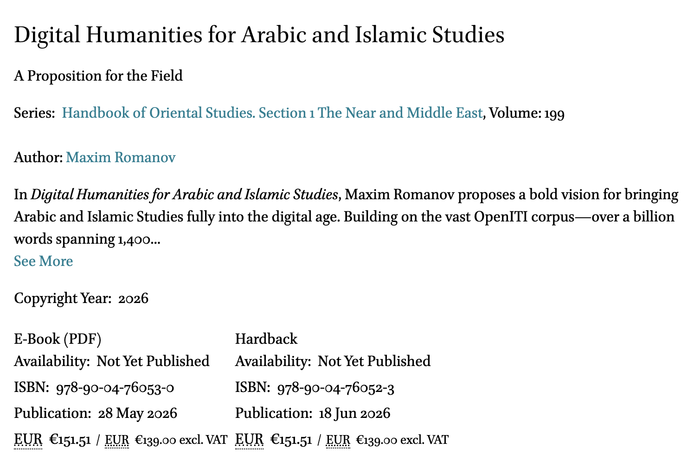

<!-- K4 -->
--- text
# What’s in the book?

**Three Chapters**

1. A Pitch for the DH
2. Digital Avatars and Metaobjects
3. Computational Inquiries

In short, this book asks: <em>What does it mean for our field when the entire library becomes a vademecum—something that, quite literally, “goes with me” everywhere? What new possibilities and responsibilities does this transformation bring?</em>

<!-- S1 -->
--- section

The instrument

# A corpus in time

OpenITI: the Arabic written tradition as a chronological distribution

<!-- K11 -->
--- text
# The Library That Arrived Unexpected

<b>8,600+</b>classical Arabic texts

<b>1 billion+</b>words in the corpus

<b>1,300+</b>years of written Arabic

A treasure without a map. A library without a methodology. A field that found itself unprepared.

What do we do when the entire library becomes a vademecum?!

<!-- K12 -->
--- text
# OpenITI, v. 2023.1.8 — “clean”

Our final subcorpus, based on version 2023.1.8, consisting solely of “clean” unique texts written up to 1400/1980:

<ul class="plain">
<li>– 2,783 unique authors (156 fewer than in the set above, or 94.69%)</li>
<li>– 7,058 unique texts (−407 fewer, or 94.55%)</li>
<li>– 927.37 million tokens before cleaning</li>
<li>– 868.81 million tokens after removal of most paraeditorial material and remaining “unclean” (93.68% of the uncleaned set)</li>
</ul>

<!-- K13 -->
--- figure
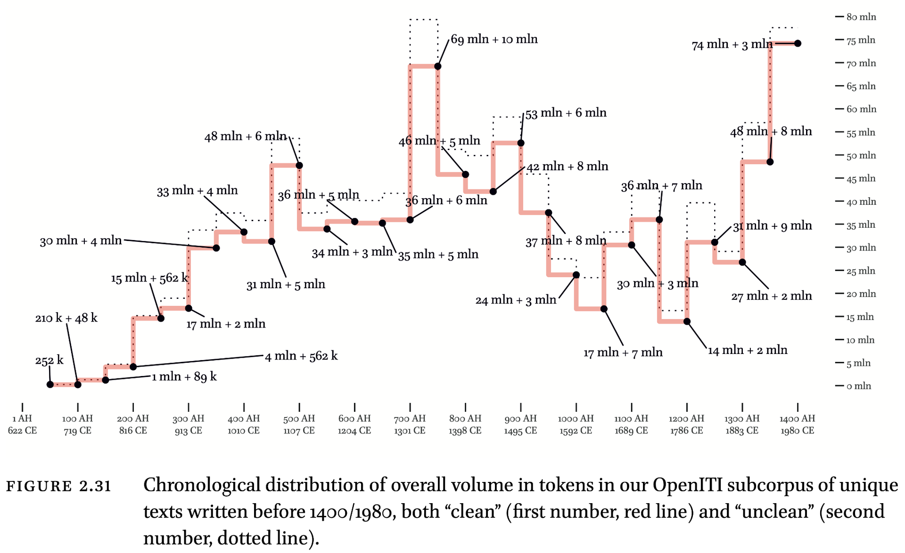

<!-- K14 -->
--- text steps
# But a corpus is also a historical source

<ul class="indent">
<li>Survival bias — what reached us</li>
<li>Editorial / digitization bias — what modern scholars chose to publish</li>
<li>Uneven genre and chronological coverage</li>
</ul>

Source criticism begins with the instrument.

<!-- K15 -->
--- figure
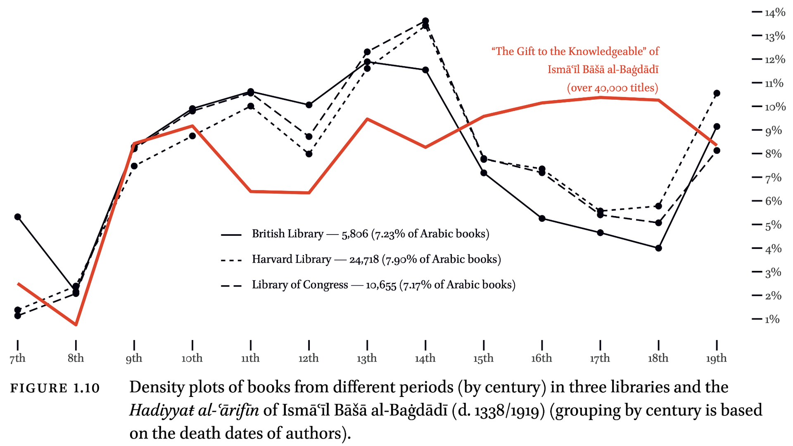

<!-- K16 -->
--- figure
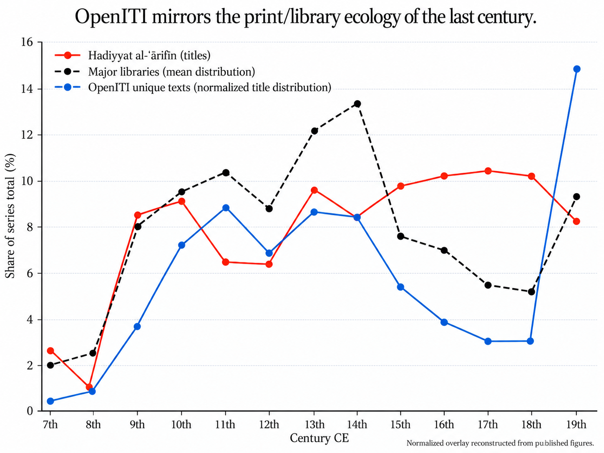

<!-- S2 -->
--- section

Case 1

# A term in time

When did <em>al-kutub al-sittaŧ</em> come to be?

<!-- K24 -->
--- figure
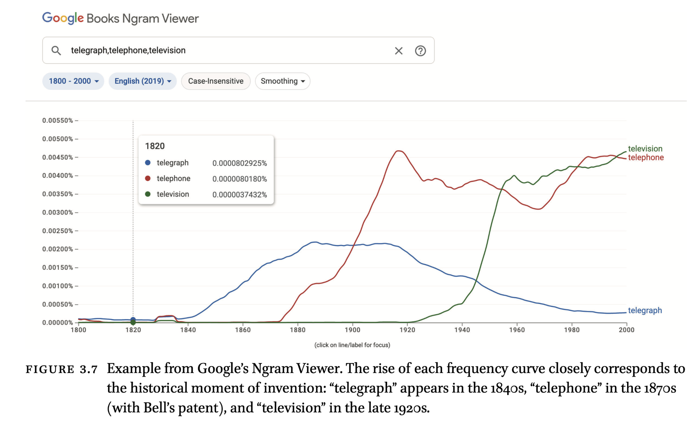

<!-- K25 -->
--- text
# Case Study 1: Tracing Term Usage

<strong>2.1 &nbsp; <em>From “The Devil’s Delusions” to Ḥadīṯ Studies</em></strong> 
Now that we have a general sense of how the OpenITI NgramReader works, let’s consider a more complex inquiry, this time into terminology central to the study of Ḥadīṯ. In the early 2000s, I made my first attempt at writing a PhD thesis at the Institute of Oriental Manuscripts of the Russian Academy of Sciences in my hometown of St. Petersburg. My dissertation focused on a close reading of “The Devil’s Delusions” (<em>Talbīs Iblīs</em>) by Ibn al-Jawzī (d. 597/1201), the renowned historian, traditionist, and—perhaps most importantly—Ḥanbalī preacher (<em>wāʿiẓ</em>) of Baġdād.

<strong>2.2 &nbsp; <em>Proposition 1: The Chronology of Transmission Terms</em></strong> 
<strong>2.3 &nbsp; <em>Proposition 2: The Decline of</em> Isnāds</strong> 
<strong>2.4 &nbsp; <em>Proposition 3: The Canonization of</em> Ḥadīṯ <em>Collections</em></strong>

<!-- K26 -->
--- figure caption="ADHFAIS Appendix 1: NgramReader, 2025 (OpenITI, release 2023.1.7). Relative frequencies of anbaʾa-nā, aḫbara-nā, and ḥaddaṯa-nā, with LOESS smoothing."
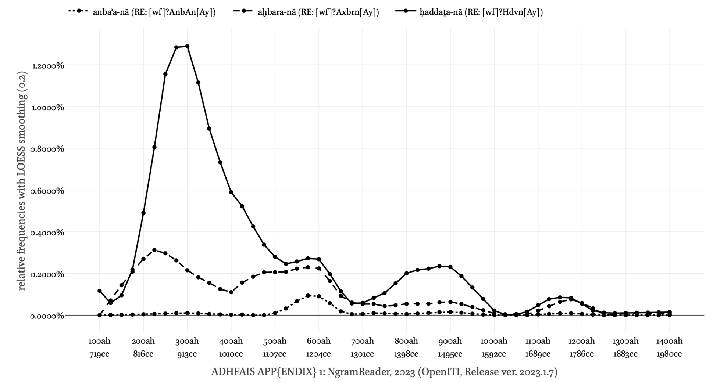

<!-- K27 -->
--- figure
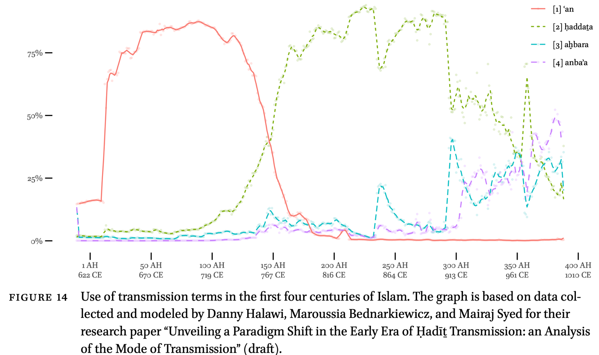

<!-- K28 -->
--- figure
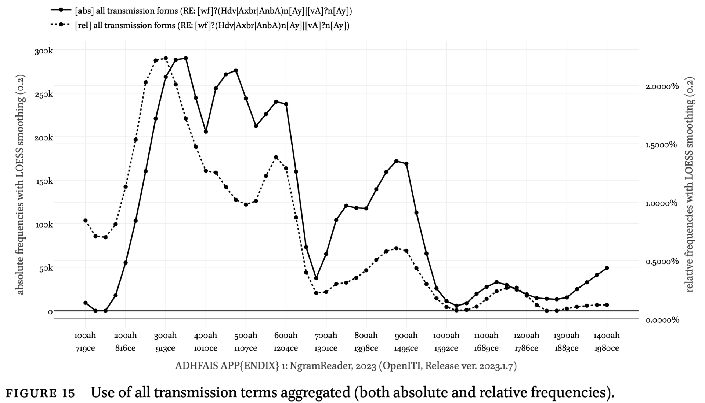

<!-- K29 -->
--- figure
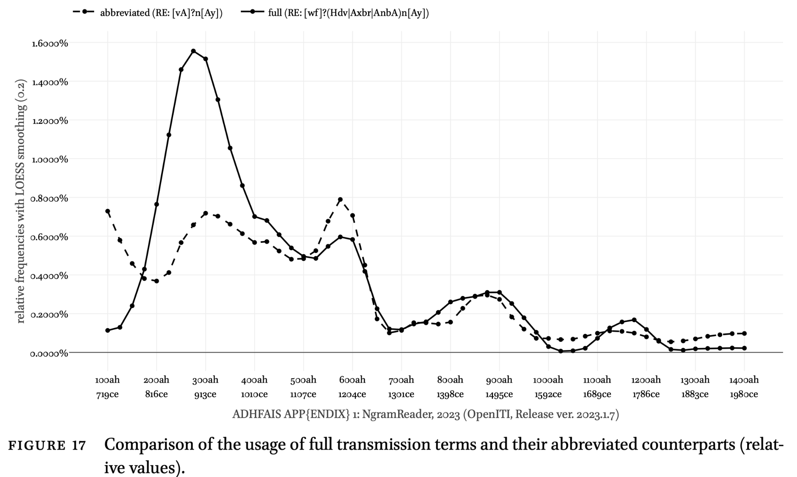

<!-- K30 -->
--- figure
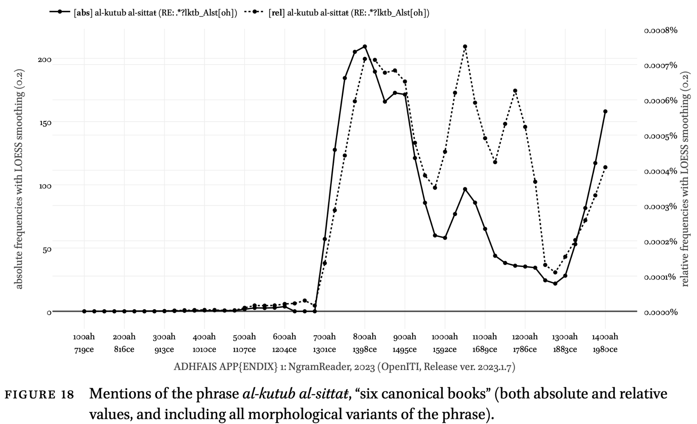

<!-- K31 -->
--- figure
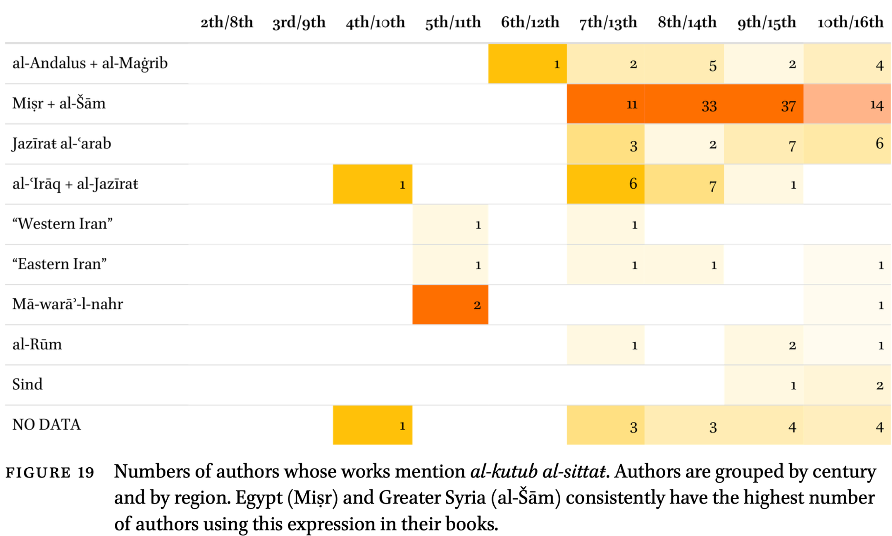

<!-- S3 -->
--- section

Case 2

# A book among books

Text reuse and the modeling of text types

<!-- G19 -->
--- text
# A Story and Its Versions: Ṯimār al-qulūb of al-Ṯaʿālibī (d. 429/1038)

ومنهم عبد الله بن خازم السلمى والى خراسان لعبد الله بن الزبير ومن عجيب أمره أنه كان نهاية فى الشجاعة والنجدة وكان يخاف الفأر أشد مخافة فبينما هو ذات يوم عند عبيد الله بن زياد إذ أدخل عليه جرذا أبيض فتعجب منه فقال لعبد الله يا أبا صالح هل رأيت أعجب من هذا وإذا عبد الله قد تضاءل كأنه فرخ وأصفر كأنه جرادة فقال عبيد الله أبو صالح يعصى الرحمن ويتهاون بالسلطان ويقبض على الثعبان ويمشى إلى الأسد الورد ويلقى الرماح بوجهه والسيوف بيده وقد اعتراه من جرذ ما ترون أشهد أن الله على كل شيء قدير

- Among them was Abd Allãh b. Ḫāzim al-Sulamī, the governor of Ḫurāsān for Abd Allãh b. al-Zubayr. What was remarkable about him was that he was extremely brave and resourceful, yet he was terrified of mice. One day, while he was with ʿUbayd Allãh b. Ziyād, a white rat was brought before him and he was astonished. ʿUbayd Allãh said to ʿAbd Allãh, ‘O Abū Ṣāliḥ, have you ever seen anything more astonishing than this?’ And there was Abd Allãh, who had shrunk as if he were a chick and turned yellow as if he were a male locust. ʿUbayd Allãh then said, “Abū Ṣaliḥ disobeys the Merciful, takes lightly the authority, seizes the snake, walks toward the blooming lion, faces spears with his face and swords with his hands, and yet, he is overcome by a rat as you see. I testify that Allãh is capable of everything.

<!-- G20 -->
--- split w-35-65 vcenter

- Among them was Abd Allãh b. Ḫāzim al-Sulamī, the governor of Ḫurāsān for Abd Allãh b. al-Zubayr. What was remarkable about him was that he was extremely brave and resourceful, yet he was terrified of mice. One day, while he was with ʿUbayd Allãh b. Ziyād, a white rat was brought before him and he was astonished. ʿUbayd Allãh said to ʿAbd Allãh, ‘O Abū Ṣāliḥ, have you ever seen anything more astonishing than this?’ And there was Abd Allãh, who had shrunk as if he were a chick and turned yellow as if he were a male locust. ʿUbayd Allãh then said, “Abū Ṣaliḥ disobeys the Merciful, takes lightly the authority, seizes the snake, walks toward the blooming lion, faces spears with his face and swords with his hands, and yet, he is overcome by a rat as you see. I testify that Allãh is capable of everything.

|||

<!-- G21 -->
--- figure

<!-- G22 -->
--- figure

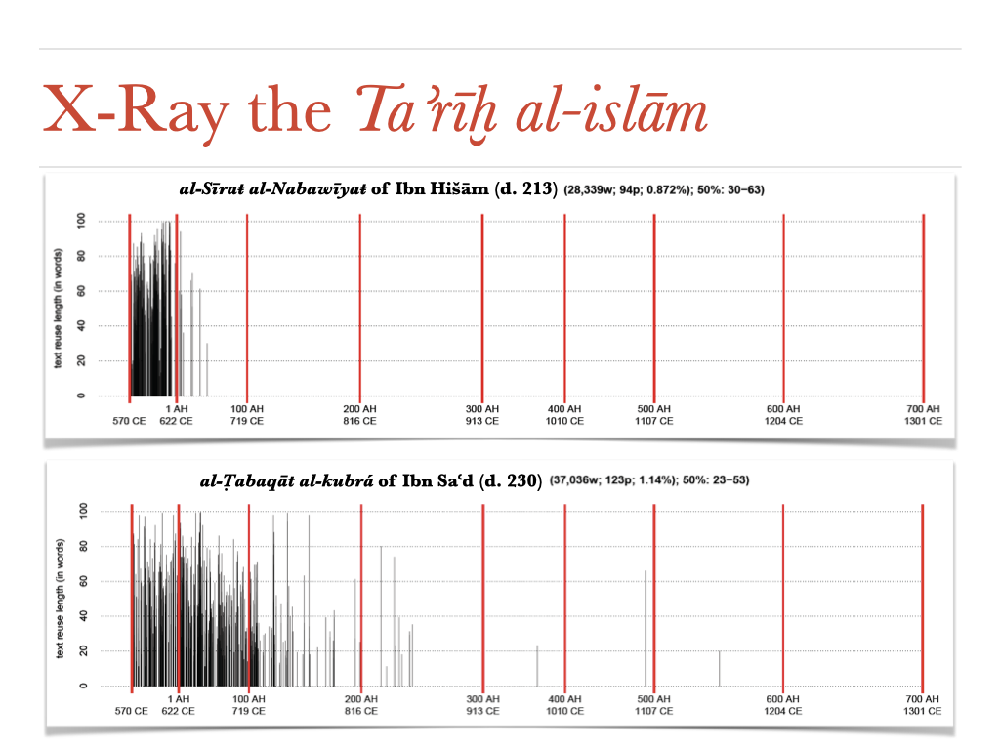

<!-- G23 -->
--- figure

<!-- G25 -->
--- figure

<!-- G26 -->
--- figure

<!-- G27 -->
--- figure

<!-- G29 -->
--- figure

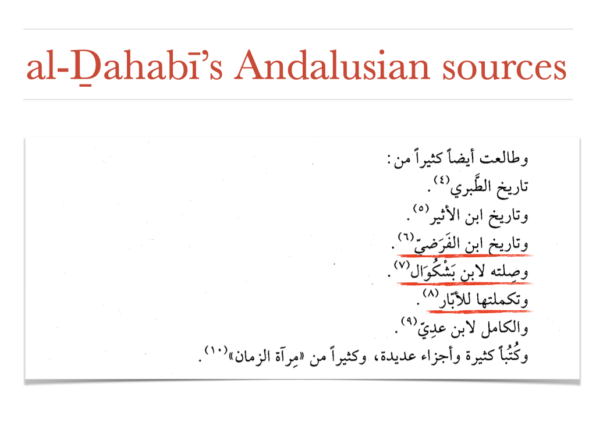

<!-- G30 -->
--- figure

<!-- G31 -->
--- figure

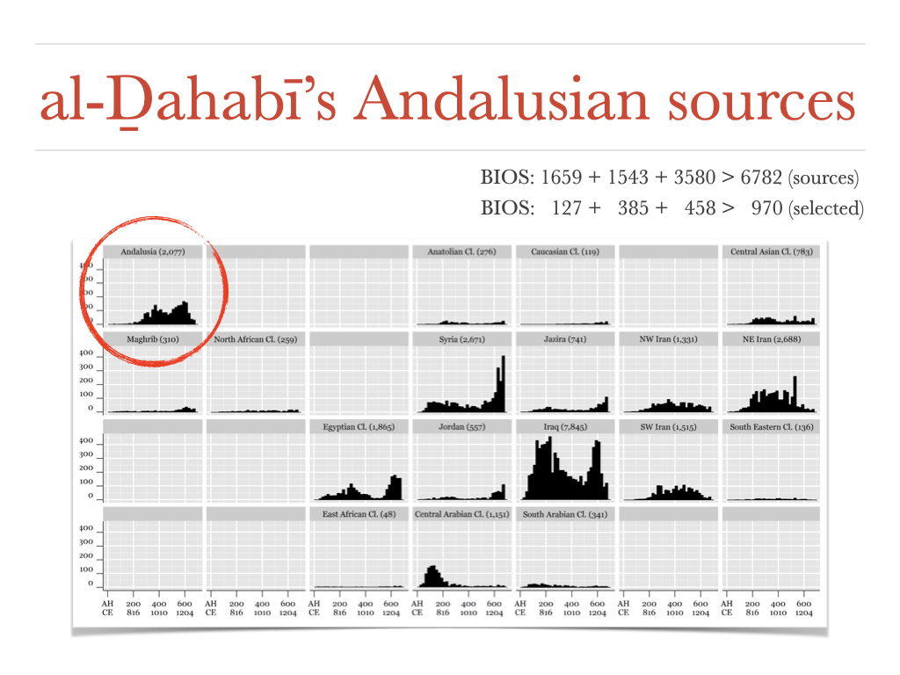

<!-- G32 -->
--- figure

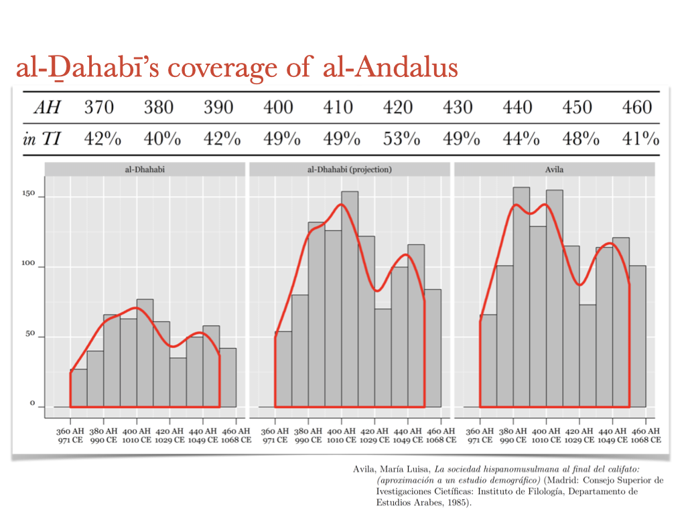

<!-- K33 -->
--- text
# Case Study 2. Modeling Textual Typology

<ol class="small" style="max-width:37em">
<li><code>[B]</code> Biographical type (<em>tarājim</em>): mostly collections of biographies</li>
<li><code>[E]</code> Exegetical type: interpretations of the Qurʾān (<em>tafsīr</em>)</li>
<li><code>[G]</code> Graeco-Arabic (“Greek-esque”) type (<em>yūnāniyyāt</em>): translations from Greek and works on the development of Greek philosophy in Arabic (<em>falsafat</em>, predominantly Aristotelian)</li>
<li><code>[H]</code> Historical type (<em>tawārīḫ</em>): mainly chronicles</li>
<li><code>[F]</code> Legal type (<em>fiqh</em>): a broad variety of legal texts</li>
<li><code>[L]</code> Linguistic type: a broad variety of grammatical, rhetorical, and lexicographical texts (<em>balāġat</em>, <em>naḥw</em>, <em>maʿājim luġawiyyat</em>)</li>
<li><code>[M]</code> Medical type (<em>ṭibb</em>): mainly texts on Galenic medicine</li>
<li><code>[P]</code> Poetic type (<em>šiʿr</em>): mainly collections of poetry (<em>dīwān</em>s)</li>
<li><code>[K]</code> “Scholastic-theological” type: works of <em>kalām</em></li>
<li><code>[Ḥ]</code> Tradition-based type: collections of <em>ḥadīṯ</em></li>
</ol>

<!-- K34 -->
--- figure frame
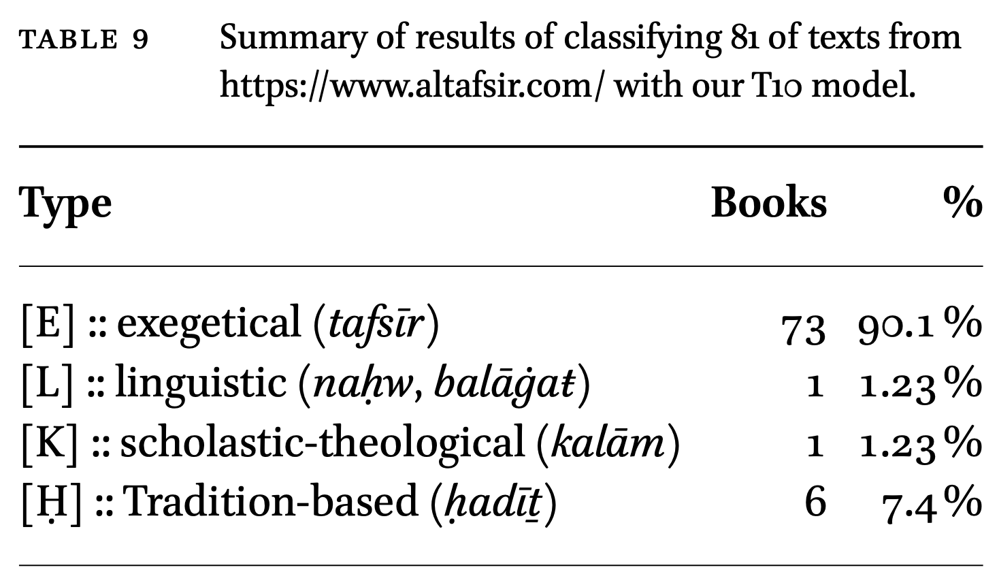

<!-- K35 -->
--- figure
# Rolling Typological Assessment
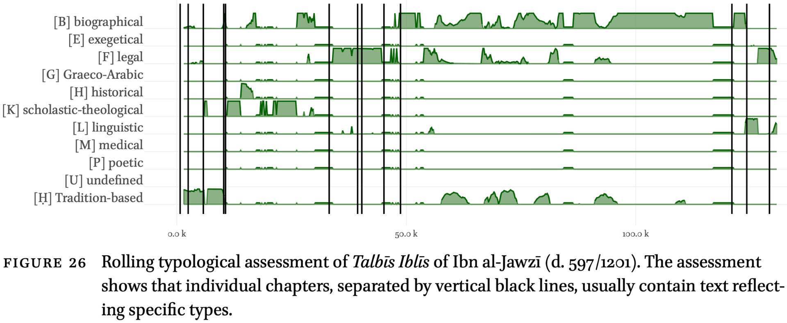

<!-- K36 -->
--- figure
# Majmūʿāt Case
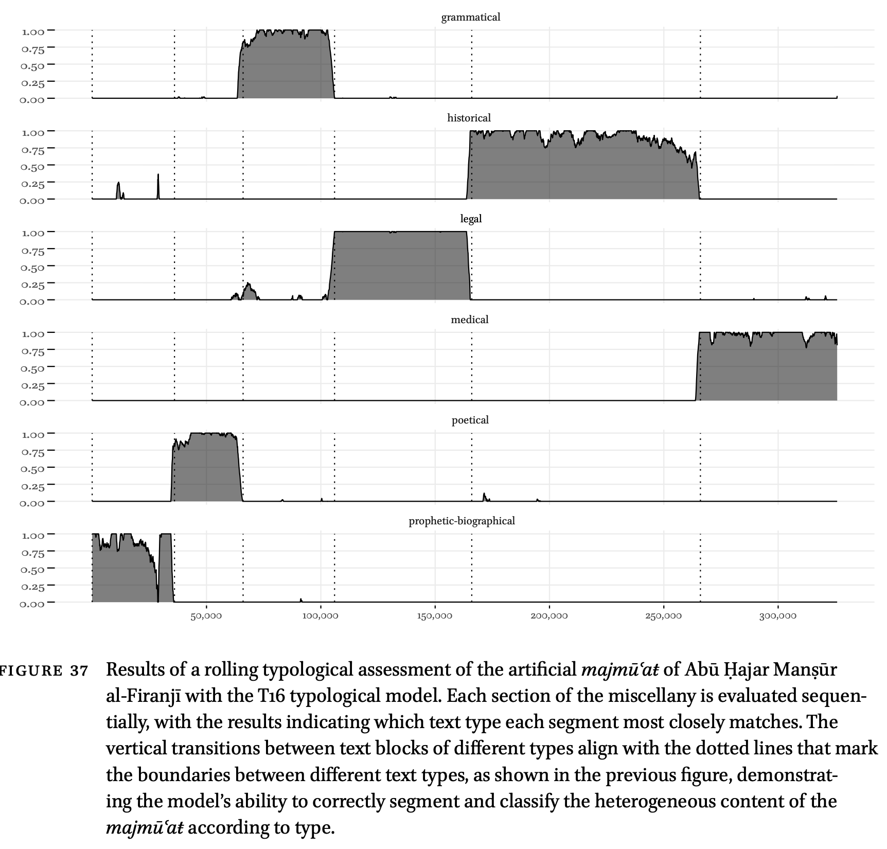

<!-- S4 -->
--- section

Case 3

# A language and a tradition in time

Periodization from how language and topics change

<!-- K38 -->
--- text
# Case Study 3. Charting Linguistic Evolution

<ul class="small" style="max-width:36em">
<li>The <strong>pre-classical period</strong> lasts from the appearance of Islam until the end of the Umayyad period (c. 1–132/622–750).</li>
<li>The <strong>classical period</strong> corresponds roughly to the ʿAbbāsid period (132–656/750–1258).</li>
<li>The <strong>postclassical period</strong> encompasses the reign of the Mamlūks (648–923/1250–1517) and most of that of the Ottomans.</li>
<li>The <strong>modern period</strong> (from Napoleon’s invasion of Egypt in 1213/1798), extending to the present day.</li>
</ul>

<!-- K39 -->
--- split w-60-40
# Case Study 3. Charting Linguistic Evolution

<ul class="plain" style="color:var(--muted)">
<li>Preclassical &nbsp; c. 622–750</li>
<li>Classical &nbsp; 750–1258</li>
<li>Postclassical &nbsp; 1258–1798</li>
<li>Modern &nbsp; 1798–</li>
</ul>

<b>Preclassical</b>600–750

<b>Classical</b>750–1258

<b>Postclassical</b>1258–1798

<b>Modern</b>1798–

Where do these lines come from?

|||

<em>Geschichte der arabischen Litteratur</em>, 5 vols. (1896–1943)

<em>Cambridge History of Arabic Literature</em>, 6 vols. (1983–2006)

<em>Encyclopedia of Arabic Language and Linguistics</em> (Brill)

<!-- K40 -->
--- text
# A model the field built impressionistically

Periodization is unavoidable: 
It organizes research, explanation, teaching. It is a major historian’s tool.

But the architecture of the standard scheme was never systematically derived from the written tradition as a whole.

What if we ask the written tradition itself?

<!-- K41 -->
--- text steps
# The obvious casualty: the Mamluk centuries

<strong>c. 1250–1517</strong>: one of the busiest periods of Arabic textual production

Yet usually absorbed into a vast “postclassical” period, often called the “<em>Period of Decadence</em>”

The category hides distinctiveness instead of explaining it

Does the corpus itself see a coherent middle period?

<!-- K42 -->
--- section light

Two witnesses

# First witness: Corpus

<!-- K43 -->
--- figure

<!-- K44 -->
--- text steps
# Two lenses on change

<strong>Keywords</strong> (TF–IDF): <em class="muted">what texts are about</em> 
<strong>Style</strong> (MFV): <em class="muted">how texts are written</em>

<ul>
<li><strong>Hundreds of parameter combinations</strong></li>
<li><strong>3,000 random samples (MFV)</strong></li>
<li><strong>72,000 dendrograms » 48 consensus trees</strong></li>
</ul>

Do not trust a tree. Ask what survives across trees.

<b>Content</b><em>keywords / TF–IDF</em>

<b>Style</b><em>most frequent vocabulary</em>

<!-- K45 -->
--- split w-35-65 vcenter
# Style

stylometry

<ul class="small" style="font-style:italic">
<li>distributions of frequencies of most frequent words (function words) are unique to individual:</li>
</ul>
<ul class="small" style="font-style:italic;list-style:disc">
<li><strong class="accent">authors</strong></li>
<li>periods</li>
</ul>

|||

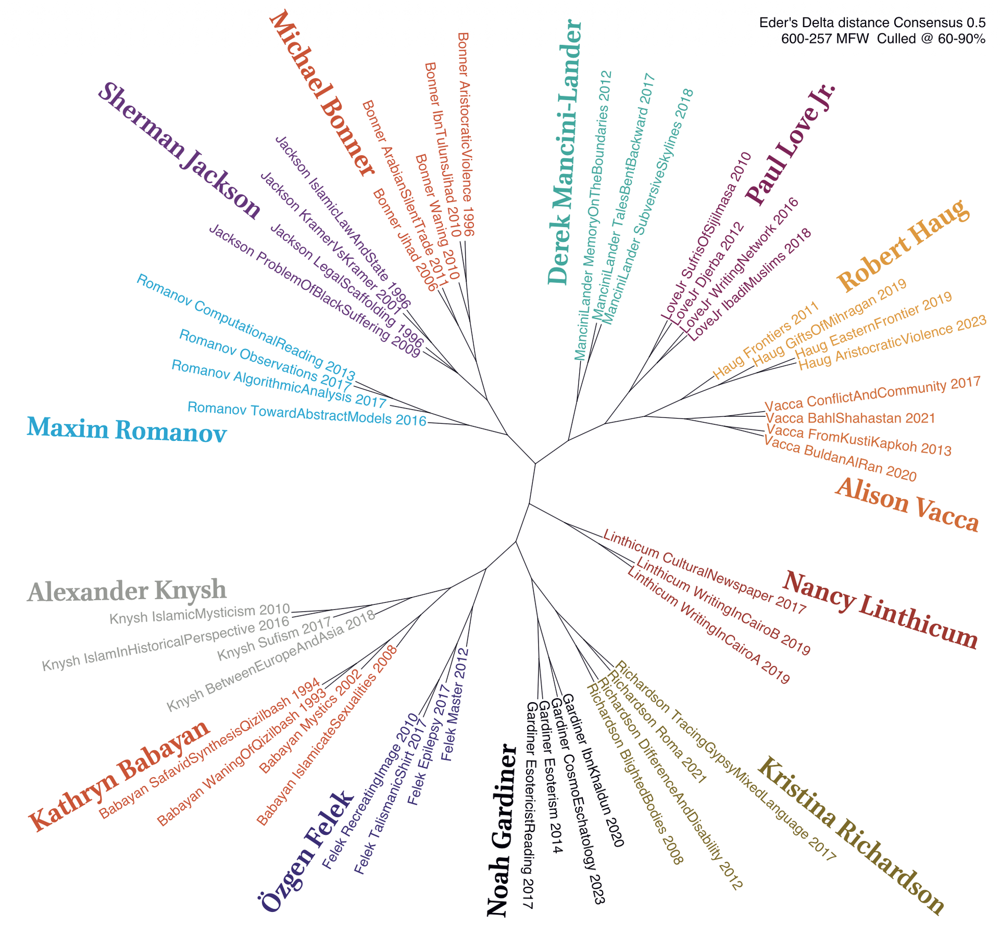

<!-- K46 -->
--- split w-35-65 vcenter
# Style

stylometry

<ul class="small" style="font-style:italic">
<li>distributions of frequencies of most frequent words (function words) are unique to individual:</li>
</ul>
<ul class="small" style="font-style:italic;list-style:disc">
<li>authors</li>
<li><strong class="accent">periods</strong></li>
</ul>

<strong>Jurjī Zaydān’s writings</strong> (1) 1891–1902 · (2) 1903–1905 · (3) 1906–1914

|||

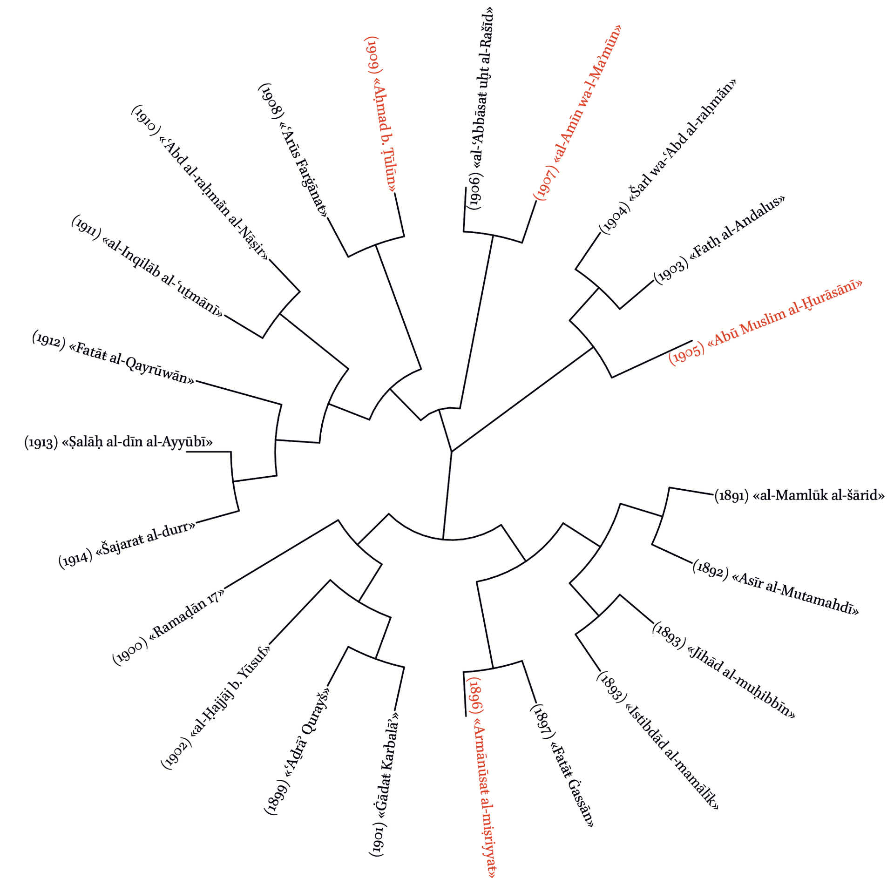

<!-- K47 -->
--- figure caption="A single dendrogram of 50-lunar-year samples of the corpus, colored by macroperiod. Hijrī dates!"
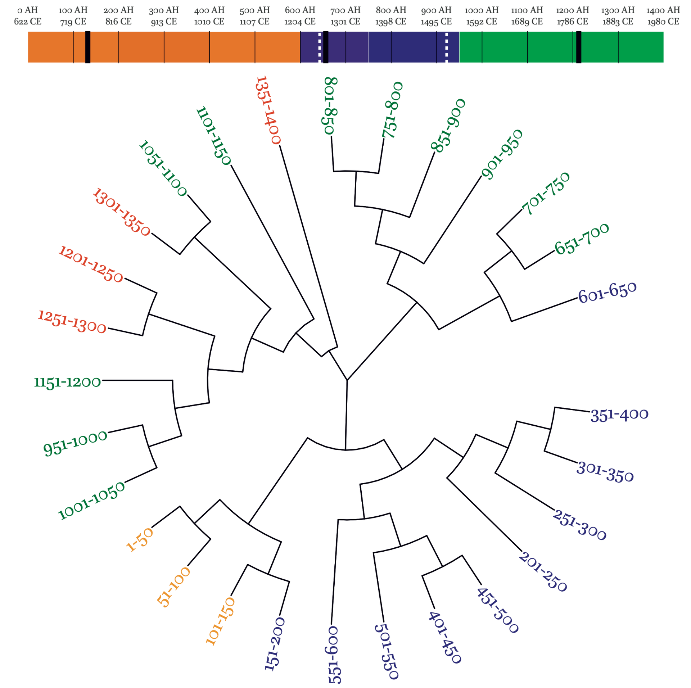

<!-- K48 -->
--- figure caption="72,000 dendrograms: hundreds of parameter combinations over 3,000 random samples."
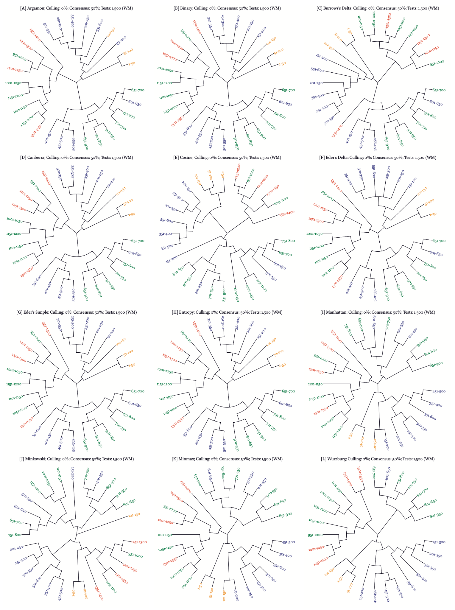
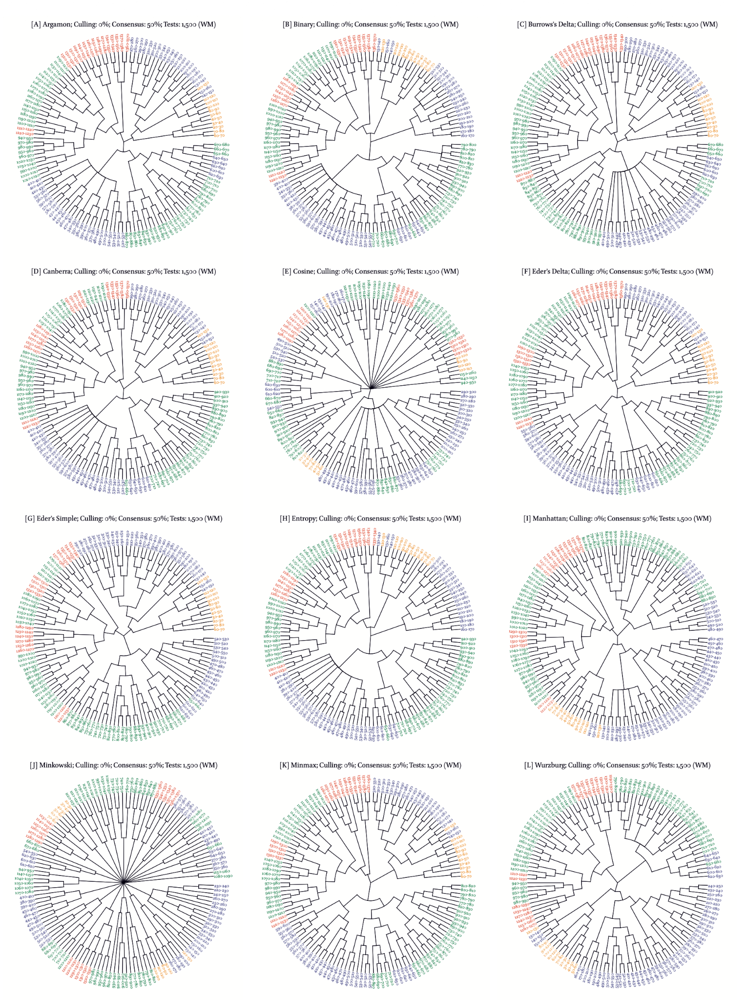

<!-- K49 -->
--- figure caption="Summary stripe diagrams: what survives across the trees."
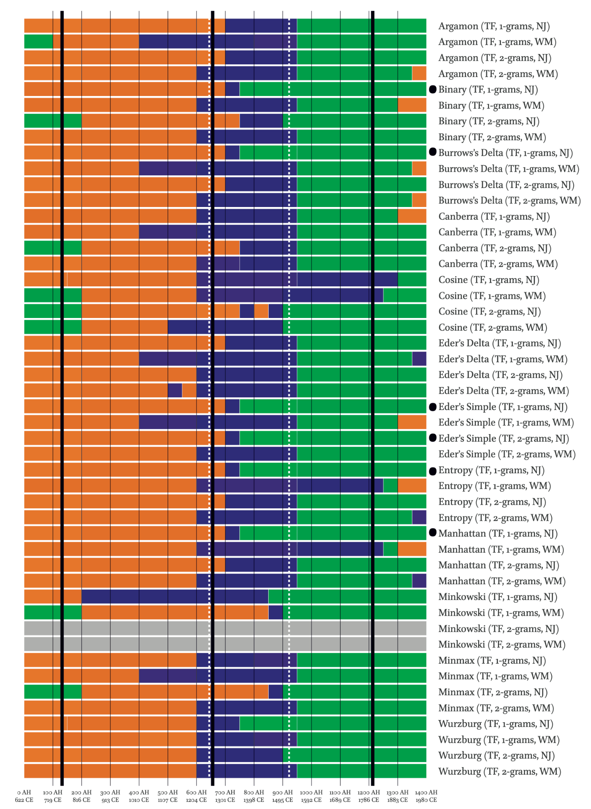
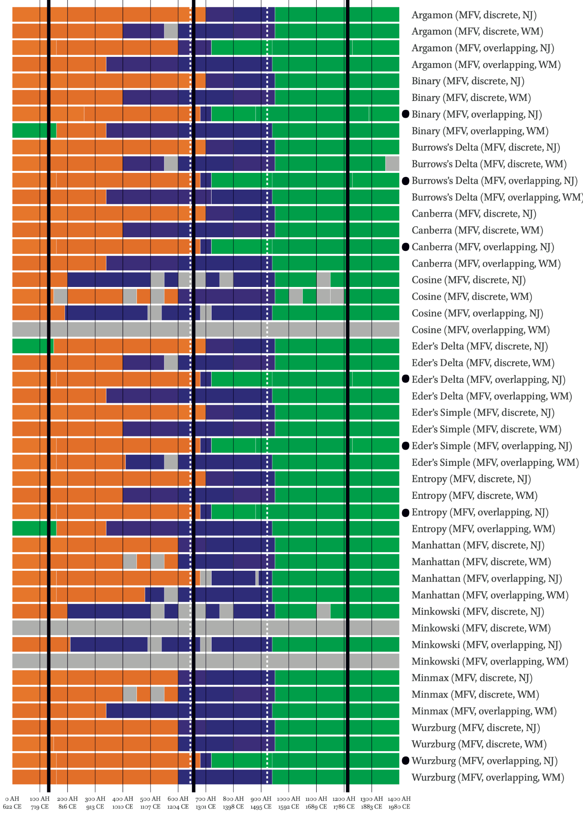

<!-- K50 -->
--- text
# Major periods

<ul class="indent">
<li>The early macroperiod (622–1200)</li>
<li>The middle macroperiod (1200–1540)</li>
<li>The late macroperiod (1540–1980)</li>
</ul>

<strong>Results of majority of 72,000 dendrograms:</strong>

3,000 stylometric samples (1,500 discrete; 1,500 overlapping) 12 distance metrics, 2 major clustering algorithms; 48 tf-idf keyword tests.

<!-- K51 -->
--- text steps
# The middle macroperiod (c. 1200–1540)

<ul class="indent">
<li><em>Thematic profiles</em> isolate it as a distinct period</li>
<li><em>Stylometric profiles</em> often attach it to the early macroperiod</li>
<li>The language evolves slower than the written tradition: new distinct themes, but older language</li>
</ul>

Two clocks: themes shift faster than language.

<!-- K52 -->
--- text
# A different macrohistory of the written tradition

<ul class="plain indent">
<li>Early: c. 622–1200</li>
<li>Middle: c. 1200–1540</li>
<li>Late: c. 1540–1980</li>
<li>Boundaries are transition zones, not event dates</li>
</ul>

<b>Early</b>c. 622–1200

<b>Middle</b>c. 1200–1540

<b>Late</b>c. 1540–1980

<!-- K53 -->
--- section light

Two witnesses

# Second witness: Bio-Bibliographical Collection

<!-- K54 -->
--- text
# Second witness: 8,800 authors

Ismāʿīl Bāšā al-Baġdādī (d. 1338/1919)

<em>Hadiyyat al-ʿārifīn</em> <em>c. 8,800 authors; 40,000+ titles</em> A bio-bibliographical model of the tradition

<strong>Independent of the corpus experiments</strong>

<b>8,800</b>authors

<b>40,000+</b>titles

<!-- K55 -->
--- figure
# c. 600–1200: an Iraqi-Iranian world
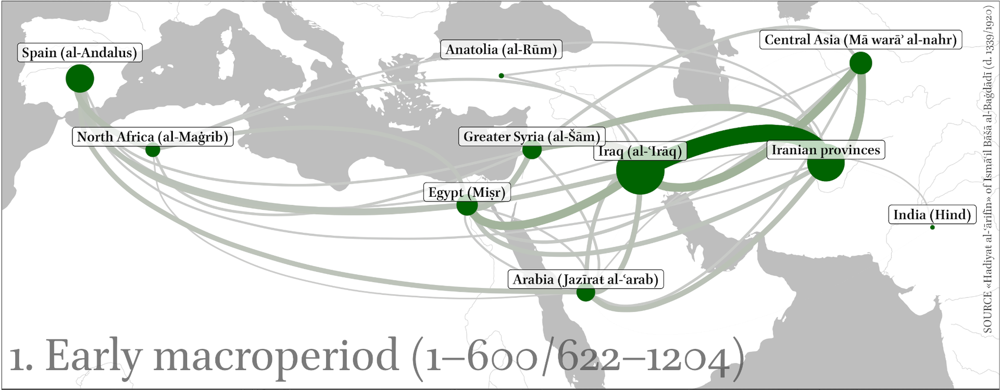

<b style="font-size:36px">&gt; 80% Iraq + Iran</b>

<!-- K56 -->
--- figure caption="Annual production by region in the early macroperiod: Iraq (al-ʿIrāq) and the Iranian provinces."
# c. 600–1200: an Iraqi-Iranian world
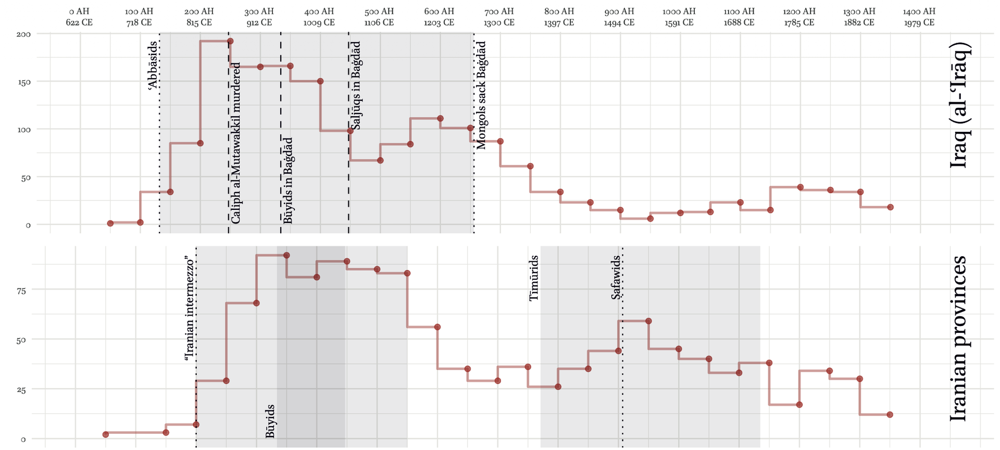

<b style="font-size:36px">&gt; 80% Iraq + Iran</b>

<!-- K57 -->
--- figure
# c. 1200–1540: a Syrian-Egyptian world
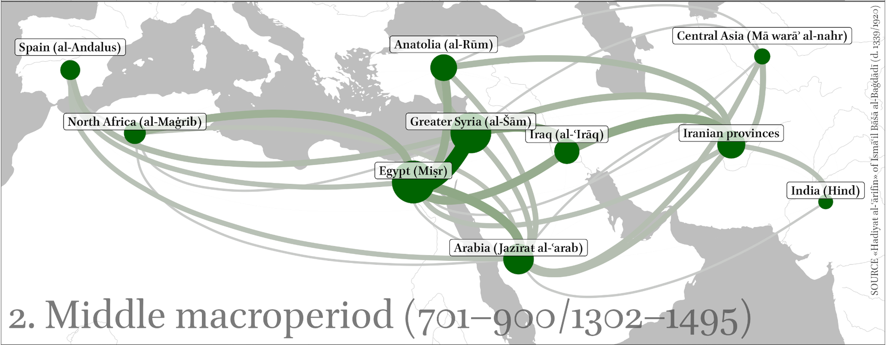

<b style="font-size:36px">&gt; 55% Egypt + Syria</b>

<!-- K58 -->
--- figure caption="Annual production by region in the middle macroperiod: Syria (al-Šām) and Egypt (Miṣr)."
# c. 1200–1540: a Syrian-Egyptian world
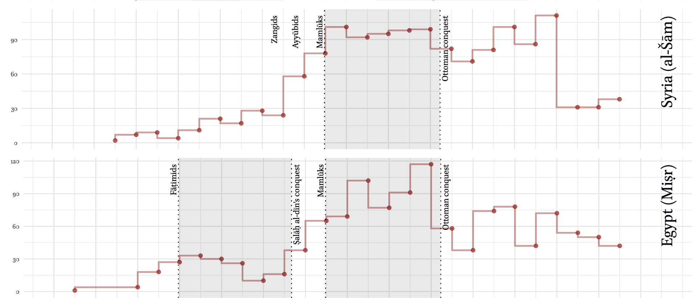

<b style="font-size:36px">&gt; 55% Egypt + Syria</b>

<!-- K59 -->
--- figure
# After c. 1540–1900: a new polycentric geography
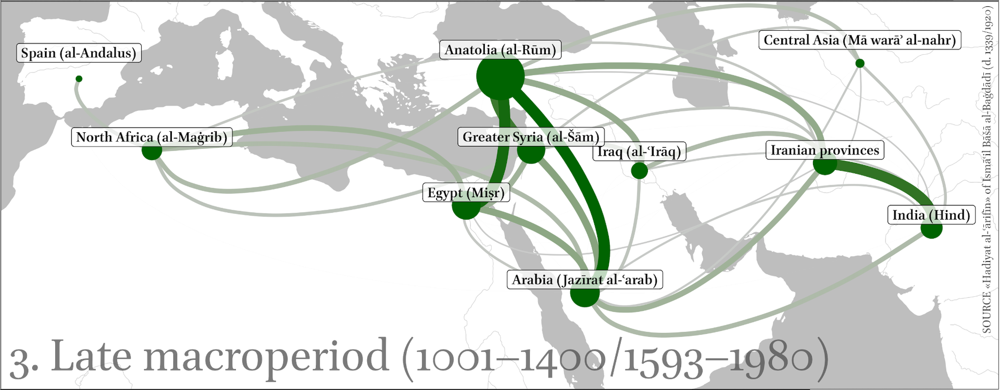

<b style="font-size:36px">≈ 30% Anatolia</b>

<!-- K60 -->
--- figure caption="Annual production by region in the late macroperiod: India (Hind) and Anatolia (al-Rūm)."
# After c. 1540–1900: a new polycentric geography
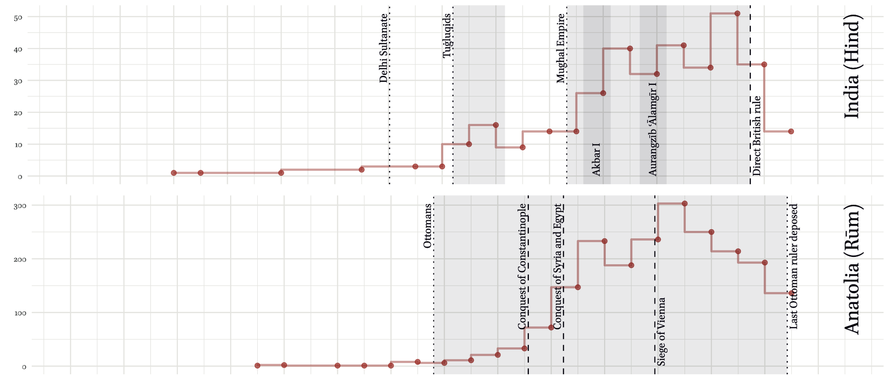

<b style="font-size:36px">≈ 30% Anatolia</b>

<!-- K61 -->
--- text steps
# Two transitions: <strong>1200–1300</strong> and 1500–1600

<ul class="indent">
<li>Westward movement from Iraq and Iran begins before the Mongol conquest</li>
<li>Andalusi scholars move east as Christian expansion advances in Iberia</li>
</ul>

<strong>Baghdad’s fall occurs inside an already-moving geography</strong>

<!-- K62 -->
--- figure
# Patterns: Great Cities of Islam

<!-- K63 -->
--- figure
# Two transitions: <strong>1200–1300</strong> and 1500–1600
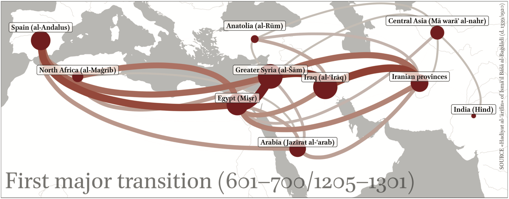

<!-- K64 -->
--- text
# Two transitions: 1200–1300 and <strong>1500–1600</strong>

<ul class="indent">
<li>The rise of the Ottoman Empire marks the emergence of a Turco-Arabic world under Ottoman control</li>
<li>and the parallel development of an Indo-Iranian sphere.</li>
</ul>

<!-- K65 -->
--- figure
# Two transitions: 1200–1300 and <strong>1500–1600</strong>
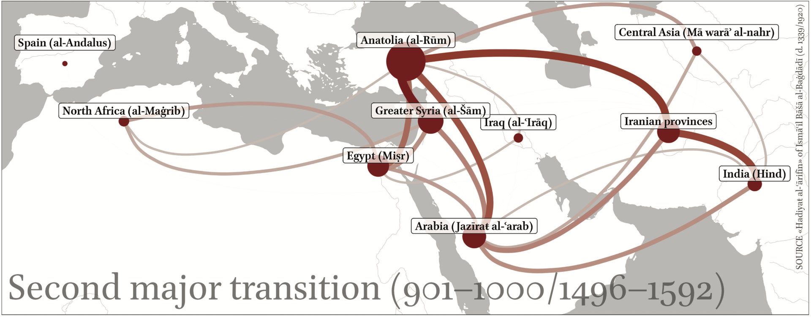

<!-- K66 -->
--- text
# Two independent witnesses

<strong>CORPUS of TEXTS</strong> lexical/thematic and stylometric change

<strong>REGISTER of AUTHORS</strong> cultural geography over time

Different biases. Different assumptions. Similar macro-boundaries.

<!-- K67 -->
--- text steps
# Three long cultural regimes (macroperiods)

<ol class="indent">
<li>The early Iraqi-Iranian &nbsp;·&nbsp; <em>c. 622–1200</em></li>
<li>The middle Syrian-Egyptian &nbsp;·&nbsp; <em>c. 1200–1540</em></li>
<li>The late Turco-Indian &nbsp;·&nbsp; <em>c. 1540–1980</em></li>
</ol>

(with discernable sub-periods inside each)

<!-- K68 -->
--- figure frame
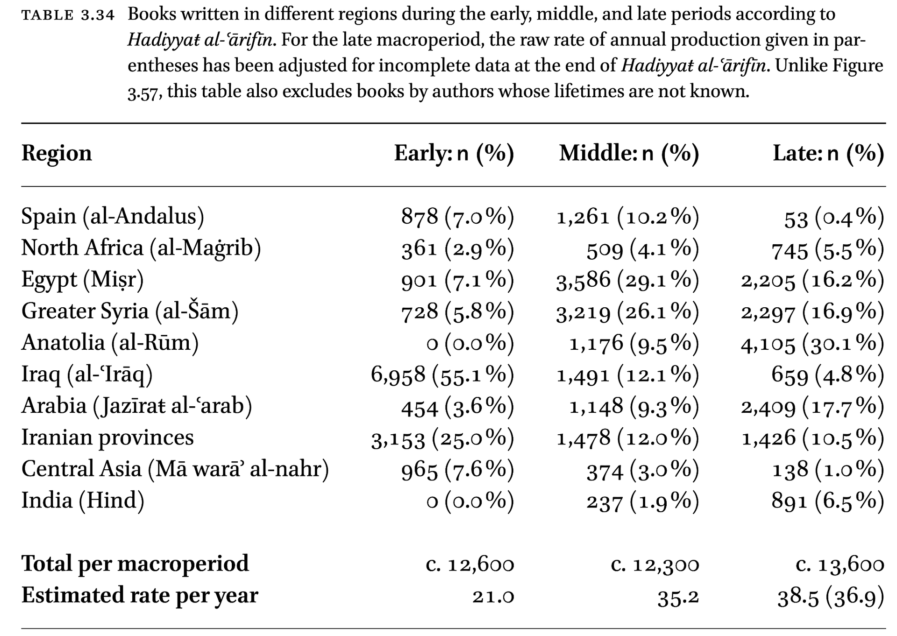

<!-- K69 -->
--- text steps
# Periods are also places

<ul class="indent">
<li><strong>Traditional periodization</strong> assumes universality</li>
<li><strong>Computational periodization</strong> demonstrates that <em>language and textual production are aligned in time with changing cultural geography</em> *</li>
</ul>

Each period gets not just a name, but also a map.

(* to be redone on the EIS1600 data: 600,000 bios &gt; c. 130,000 individuals)

<!-- K70 -->
--- text steps
# What changes if we accept this model?

<ul class="indent">
<li>The Mamluk centuries become a coherent middle period, <em>not the beginning of decline</em></li>
<li><strong>1258</strong> is recontextualized as an event within a longer transition (1200–1300)</li>
<li><strong>c. 1540</strong> emerges as a major structural break (essentially, the end of the Mamluk period)</li>
<li>Chronology &amp; geography become part of the same explanation</li>
</ul>

<!-- K71 -->
--- full contain
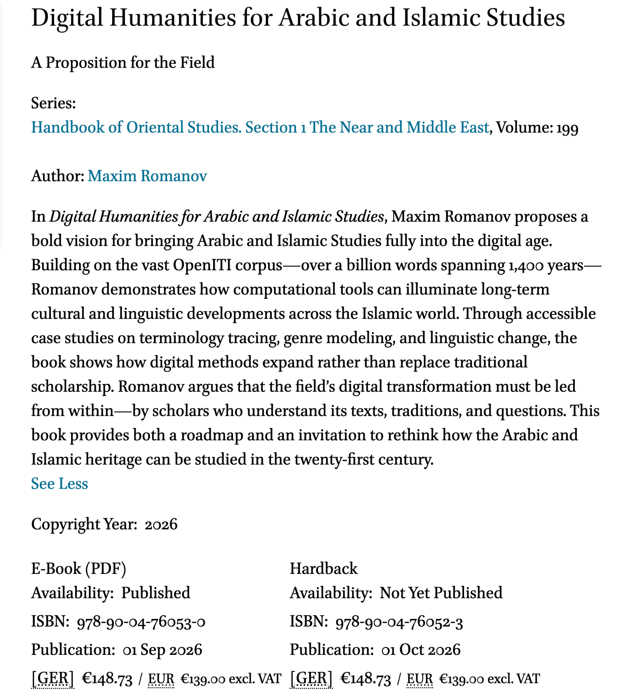

<!-- K72 -->
--- text
# Afterword: <em>farḍ al-kifāyaŧ</em>

A communal duty in Islamic law: if enough members of a community fulfill it, the rest are absolved. If all neglect it, the entire community is accountable.

No one else will digitize our texts.

No one will create our corpora.

No one will develop methods for our research questions.

This is our responsibility, and ours alone.

<!-- K73 -->
--- split w-35-65 no-strip
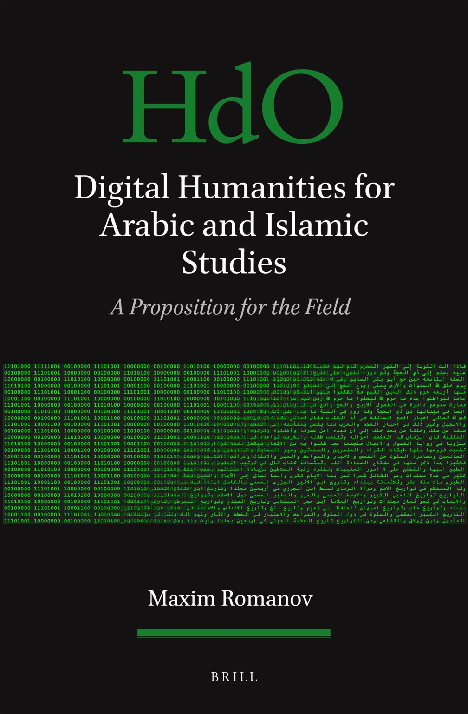

|||

In short, this book asks:

«What does it mean for our field when the entire library becomes a vademecum — something that, quite literally, “goes with me” everywhere?»

<h3 style="font-size:0.70em;font-style:normal;border-top:2px solid var(--red);padding-top:.35em">Chapter 1</h3>
Why we should even bother—a question that remains at the heart of every discussion about the digital.

<h3 style="font-size:0.70em;font-style:normal;border-top:2px solid var(--red);padding-top:.35em">Chapter 2</h3>
How we might go about harnessing the new digital opportunities within the field.

<h3 style="font-size:0.70em;font-style:normal;border-top:2px solid var(--red);padding-top:.35em">Chapter 3</h3>
What we can expect to accomplish: 1) trace term usage 2) model textual typology 3) chart linguistic evolution

Altogether, the book proposes a vision of digital humanities relevant to the field of <strong>Arabic and Islamic studies</strong>. It argues that this venture is not about cheating, but about keeping up with the rest of the world and ensuring that the future of the field remains in our own hands.

