<!-- K2 -->
--- title

<!-- QR -->
--- split w-45-55 vcenter

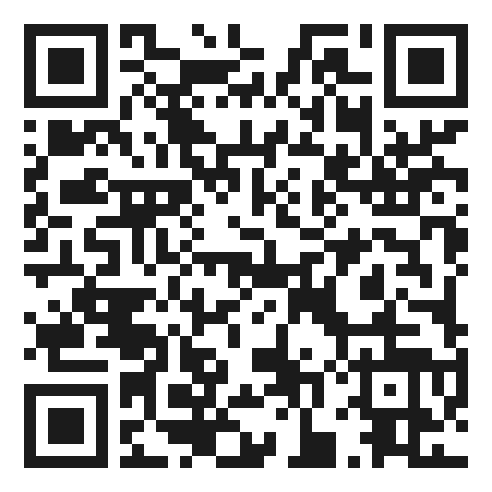

|||

<h1 lang="ar" style="font-family:var(--f-ar); font-weight:700; font-size:1.35em">دليل المحاضرة بالعربية</h1>

ملخّصٌ مفصّل للمحاضرة بالعربية، مع شرحٍ موجز لكل شريحة. امسحوا الرمز لقراءته.

<a href="https://maximromanov.github.io/slides/2026-09-28-Cairo/companion-ar.html" target="_blank" rel="noopener">maximromanov.github.io/slides/ 2026-09-28-Cairo/companion-ar.html</a>

<!-- N0 -->
--- text
# How do we know what a word means?

ما لا<b>عين</b>رأت ولا أذن سمعت

<b>ʿayn</b> eye“What no eye has seen and no ear has heard.”Ṣaḥīḥ al-Buḫārī, no. 3244

فيها<b>عين</b>جارية

<b>ʿayn</b> spring“In it is a flowing spring.”Qurʾān 88:12

فبعث<b>عينعينا</b>له من جهينة … فأتاه بخبر القوم

<b>ʿayn</b> scout, spy“He sent a scout of his from Juhaynaŧ … and the man brought him news of the people.”al-Ṭabarī, Jāmiʿ al-bayān, on Q 8:7

ثم<b>عين</b>له السلطان محمد خان … كل يوم ثمانين درهما

<b>ʿayyana</b> assigned“Sultan Meḥmed Ḫān then assigned him … eighty dirhams a day.”Ṭāšköprüzāde, al-Šaqāʾiq al-nuʿmāniyyaŧ, p. 94

We know it from what surrounds it.

<!-- N3 -->
--- text
# The same framing at every scale

١A wordis understood through the words around it: its company restricts its meaning

٢A termis understood through the corpus: when does it appear across time and space? who uses it? and who doesn’t?

٣A bookis understood through other books: what other books it builds on? how does it fit among the rest?

٤A traditionis understood through the geographical and chronological layers of books: how does its language change? how do its topics shift?

<!-- K3 -->
--- section light

The instrument

# A Proxy to the Arabic Written Tradition

OpenITI as a chronological and geographical representation

<!-- K11 -->
--- text
# OpenITI <a href="https://github.com/OpenITI">github.com/OpenITI</a>

<b>8,700+</b>titles

<b>3,300+</b>authors

<b>2.4 billion</b>words, all versions

Nigst, Lorenz, Maxim Romanov, Sarah Bowen Savant, Masoumeh Seydi, and Peter Verkinderen. <em>OpenITI: A Machine-Readable Corpus of Islamicate Texts, Primary Version.</em> Version 2025.1.9. Zenodo, 2026. <a href="https://doi.org/10.5281/zenodo.18613982">doi.org/10.5281/zenodo.18613982</a>

<!-- K12 -->
--- text
# OpenITI, v. 2023.1.8 — “clean”

Our final subcorpus, based on version 2023.1.8, consisting solely of “clean” unique texts written up to 1400/1980:

<ul class="plain">
<li>– 2,783 unique authors (156 fewer than in the set above, or 94.69%)</li>
<li>– 7,058 unique texts (−407 fewer, or 94.55%)</li>
<li>– 927.37 million tokens before cleaning</li>
<li>– 868.81 million tokens after removal of most paraeditorial material and remaining “unclean” (93.68% of the uncleaned set)</li>
</ul>

<!-- K13 -->
--- figure
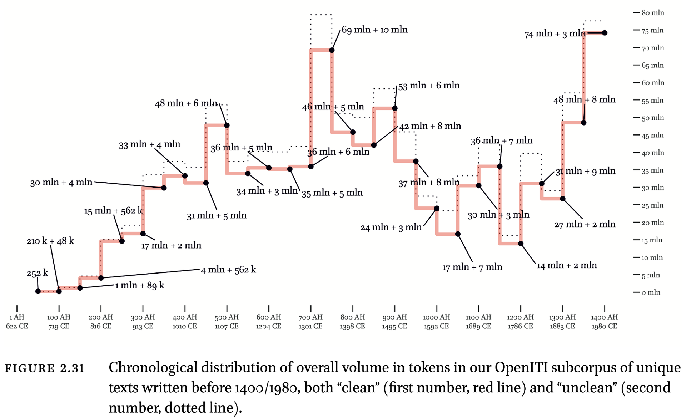

<!-- K14 -->
--- figure
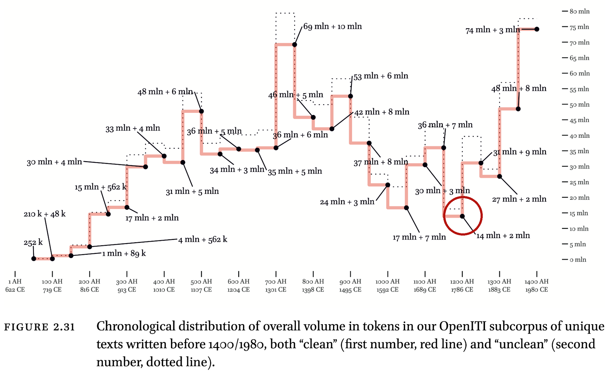

<!-- K14b -->
--- section light

Case 1

# A term in time

When did <em>al-kutub al-sittaŧ</em> come to be?

<!-- K24 -->
--- text steps
# Case 1: <em>al-kutub al-sittaŧ</em> (الكتب الستة)

In “The Devil’s Delusions” (<em>Talbīs Iblīs</em>), Ibn al-Jawzī (d. 597/1201) uses lots of <i>ḥadīṯ</i>s:

 

<em><strong>- &nbsp; No <i>isnād</i>s for</strong>: Muslim, al-Buḫārī, and Abū Dāwūd</em>

 

<em><strong>- &nbsp; Full <i>isnād</i>s for</strong>: al-Tirmiḏī, Ibn Mājah, and al-Nasāʾī</em>

 
 

No notion of <em>al-kutub al-sittaŧ</em> in the end of the 6th/12th century in Baġdād.

<!-- K26 -->
--- figure
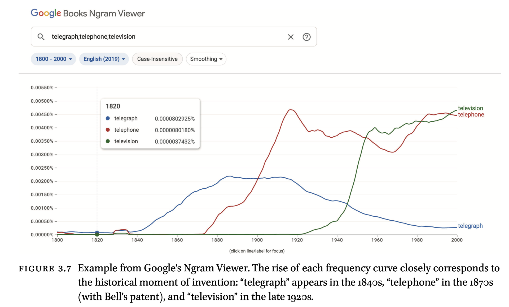

<!-- K25 -->
--- figure
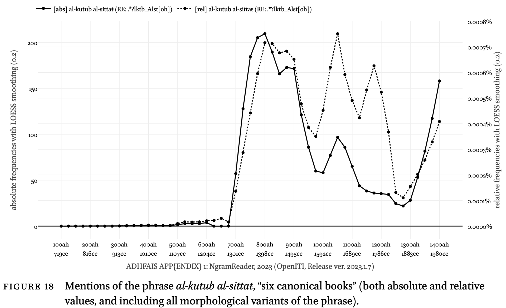

<!-- K31 -->
--- figure
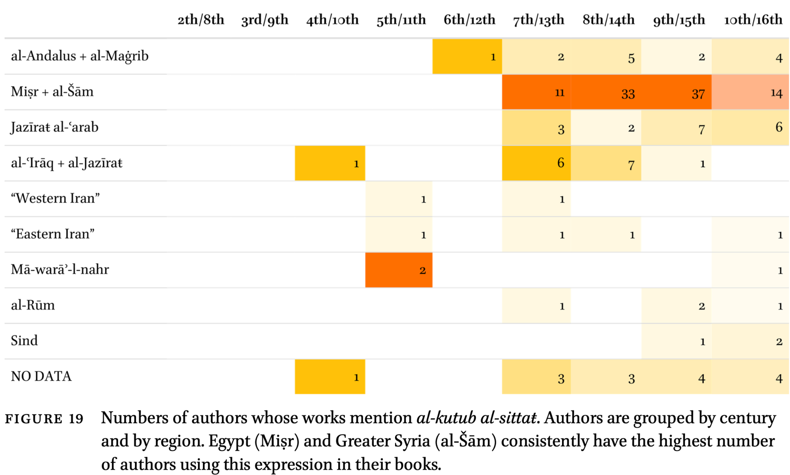

<!-- S3 -->
--- section light

Case 2

# A book among books

Text reuse and the modeling of text types

<!-- G19 -->
--- section light

Case 2a

# Text Reuse

By tracing at scale how later texts reuse earlier texts we can understand how each book fits into the tradition and how all the books form a network of interconnections

<!-- G19b -->
--- split w-25-75 vcenter

- Among them was Abd Allãh b. Ḫāzim al-Sulamī, the governor of Ḫurāsān for Abd Allãh b. al-Zubayr. What was remarkable about him was that he was extremely brave and resourceful, yet he was terrified of mice. One day, while he was with ʿUbayd Allãh b. Ziyād, a white rat was brought before him and he was astonished. ʿUbayd Allãh said to ʿAbd Allãh, ‘O Abū Ṣāliḥ, have you ever seen anything more astonishing than this?’ And there was Abd Allãh, who had shrunk as if he were a chick and turned yellow as if he were a male locust. ʿUbayd Allãh then said, “Abū Ṣaliḥ disobeys the Merciful, takes lightly the authority, seizes the snake, walks toward the blooming lion, faces spears with his face and swords with his hands, and yet, he is overcome by a rat as you see. I testify that Allãh is capable of everything.

|||

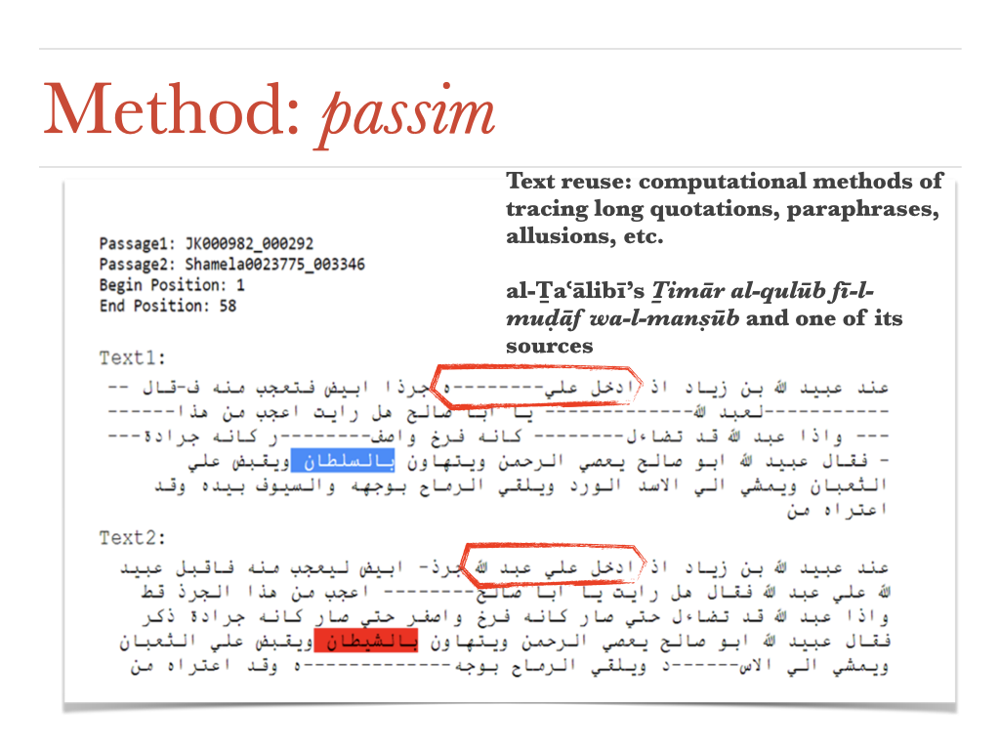

<!-- G21 -->
--- text
# al-Ḏahabī and his <i>Tārīḫ al-islām</i>

Šams al-dīn al-Ḏahabī (d. 748/1348): historian, ḥadīṯ scholar, biographer.

<em>Tārīḫ al-islām</em> — a universal chronicle-cum-biographical collection covering seven centuries of Islamic history (1–700 AH / 622–1301 CE), organized decade by decade.

<ul>
<li>c. 30,000 biographies</li>
<li>c. 3 million words</li>
<li>Two modern editions: 50 vols. (Tadmurī) and 16 vols. (Maʿrūf)</li>
</ul>

Built largely from earlier sources — an ideal test case for text-reuse detection at scale.

<!-- G21b -->
--- figure

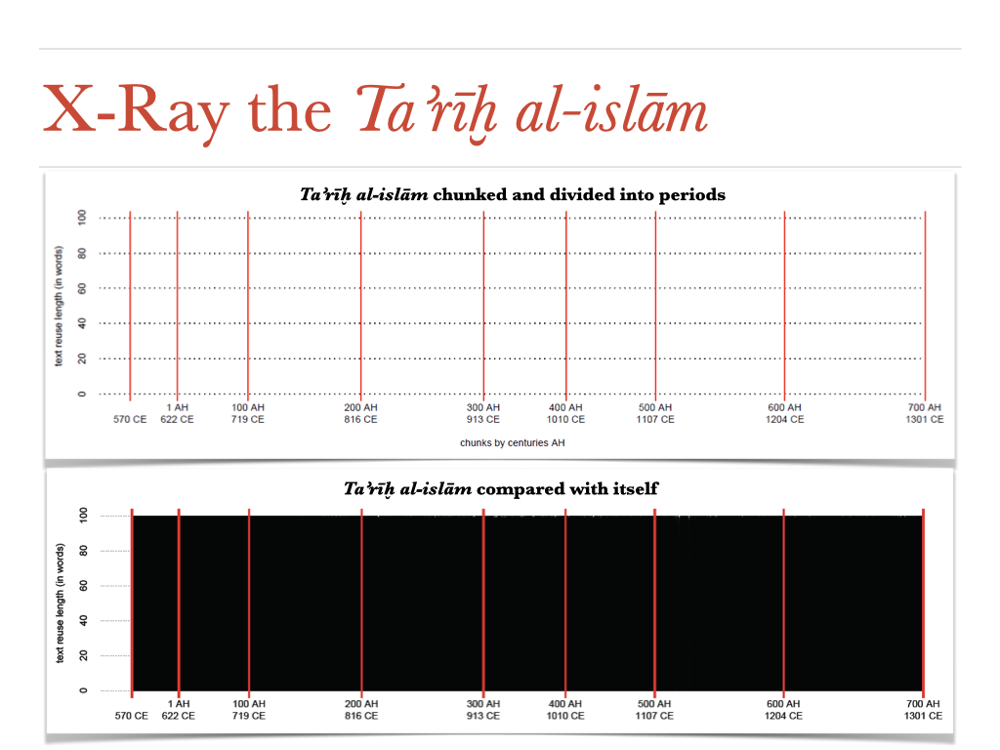

<!-- G22 -->
--- figure

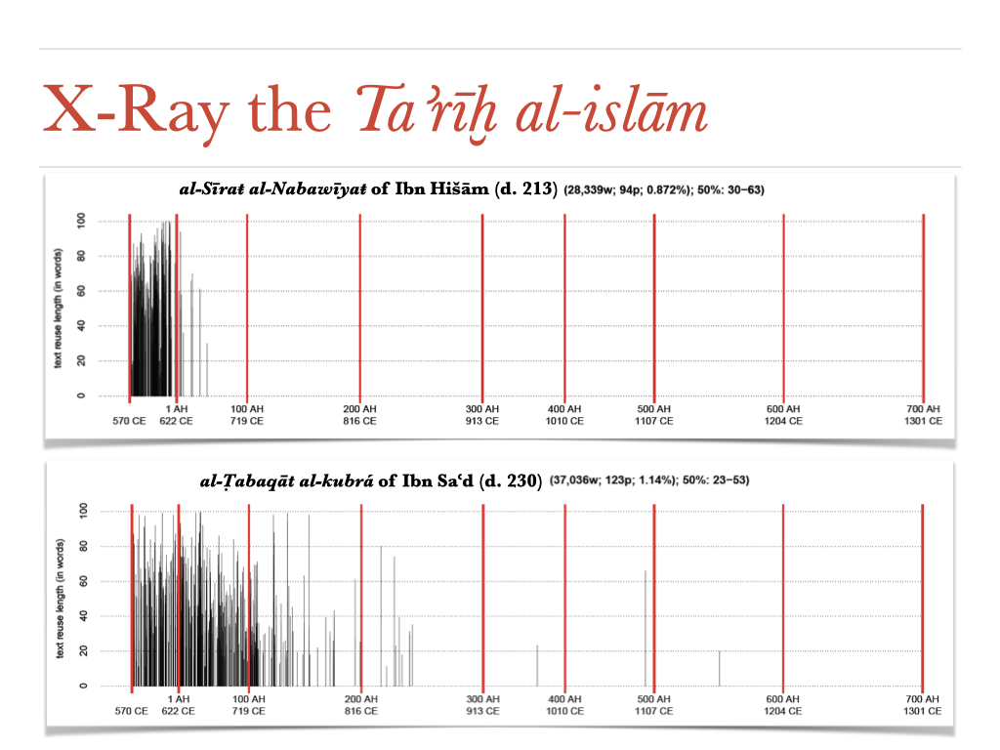

<!-- G23 -->
--- figure

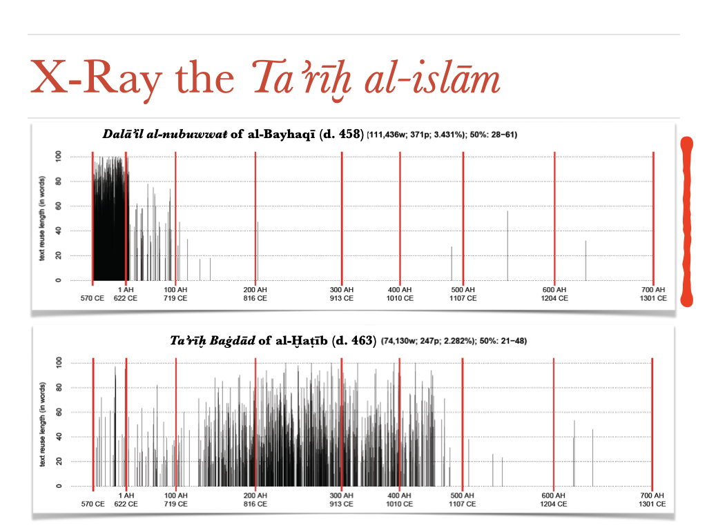

<!-- G25 -->
--- figure

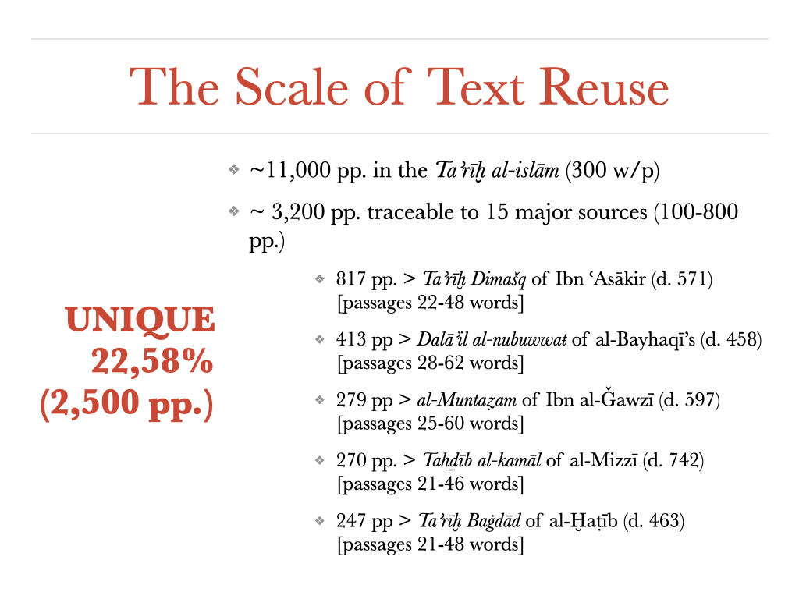

<!-- G26 -->
--- figure

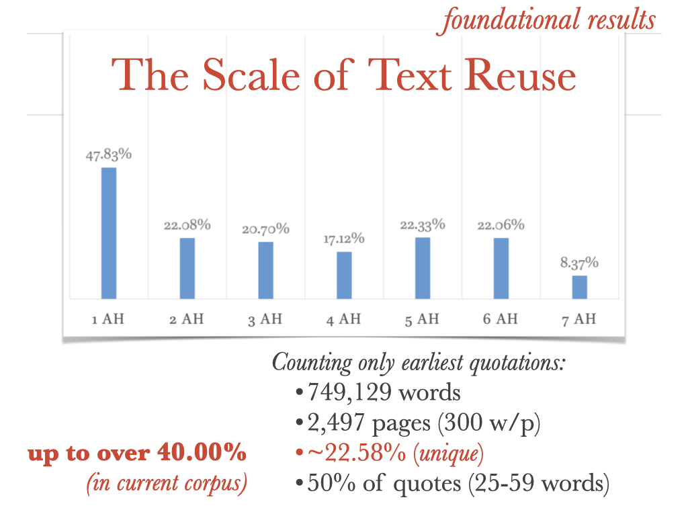

<!-- G27 -->
--- figure

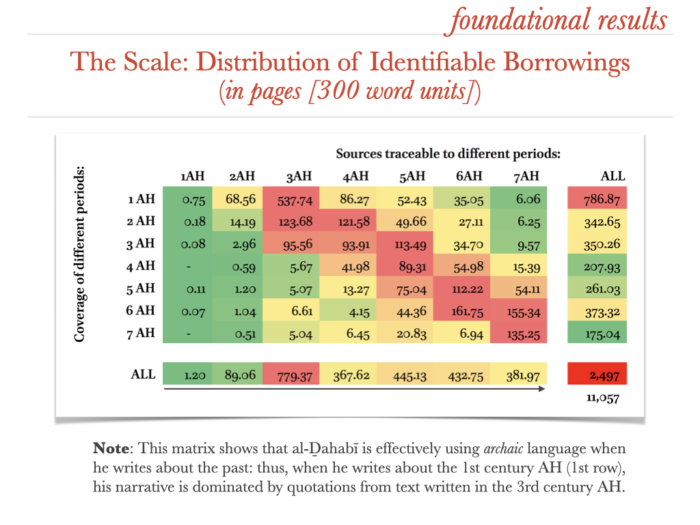

<!-- G29 -->
--- section light

Case 2b

# Modeling Textual Typology

By modeling major textual types, we can identify types of unknown books and understand the structural composition of the complex books

<!-- G29b -->
--- text
# Case 2b. Modeling Textual Typology

<ol class="small" style="max-width:37em">
<li><code>[B]</code> Biographical type (<em>tarājim</em>): mostly collections of biographies</li>
<li><code>[E]</code> Exegetical type: interpretations of the Qurʾān (<em>tafsīr</em>)</li>
<li><code>[G]</code> Graeco-Arabic (“Greek-esque”) type (<em>yūnāniyyāt</em>): translations from Greek and works on the development of Greek philosophy in Arabic (<em>falsafat</em>, predominantly Aristotelian)</li>
<li><code>[H]</code> Historical type (<em>tawārīḫ</em>): mainly chronicles</li>
<li><code>[F]</code> Legal type (<em>fiqh</em>): a broad variety of legal texts</li>
<li><code>[L]</code> Linguistic type: a broad variety of grammatical, rhetorical, and lexicographical texts (<em>balāġat</em>, <em>naḥw</em>, <em>maʿājim luġawiyyat</em>)</li>
<li><code>[M]</code> Medical type (<em>ṭibb</em>): mainly texts on Galenic medicine</li>
<li><code>[P]</code> Poetic type (<em>šiʿr</em>): mainly collections of poetry (<em>dīwān</em>s)</li>
<li><code>[K]</code> “Scholastic-theological” type: works of <em>kalām</em></li>
<li><code>[Ḥ]</code> Tradition-based type: collections of <em>ḥadīṯ</em></li>
</ol>

<!-- K34 -->
--- text

# Testing the model: exegetical type (*tafsīr*)

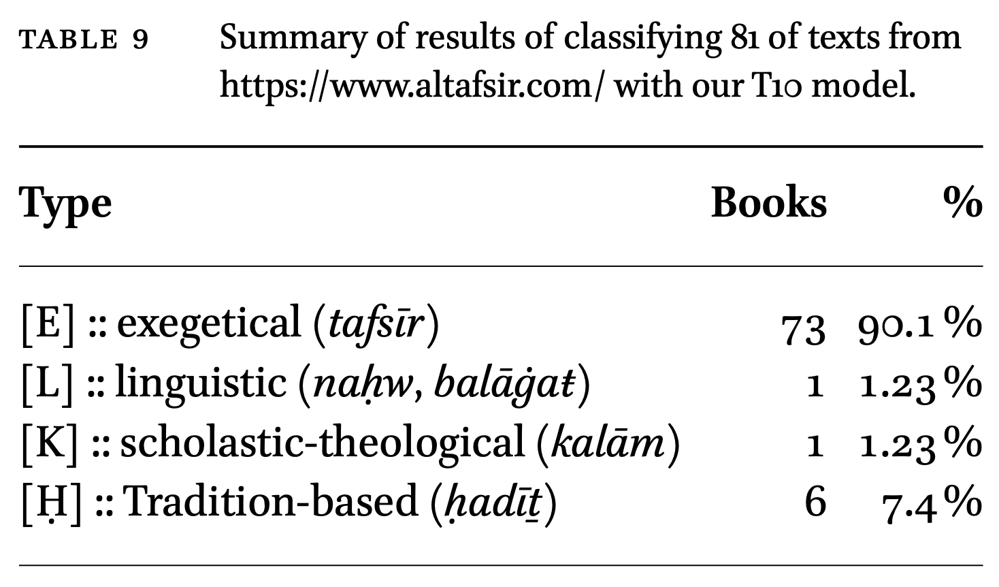

<!-- K35 -->
--- text

# The eight exceptions

<ul class="indent small" style="max-width:44em">
<li><em>Mafātīḥ al-ġayb</em> by Faḫr al-dīn al-Rāzī (d. 606/1210) → classified <code>[K]</code> scholastic-theological: it is in fact a major work of <em>kalām</em>, and samples from it were used to train the <code>[K]</code> type</li>
<li><em>Ġarīb al-Qurʾān</em> by Abū Bakr al-Sijistānī (d. 330/942) → classified <code>[L]</code> linguistic (still 26% exegetical signal): closer to a dictionary than to a traditional <em>tafsīr</em></li>
<li>Six early ḥadīṯ-based interpretations — by Mujāhid b. Jabr, ʿAbd al-Razzāq al-Ṣanʿānī, Ibn Ḥakam al-Ḥibarī, al-Nasāʾī, al-Ṭabarī, and Furāt al-Kūfī — classified <code>[Ḥ]</code> Tradition-based: composed mainly of ḥadīṯ reports, so hardly a real mistake; three still carry a strong exegetical signal (28%, 42%, 49%)</li>
</ul>

73 of 81 texts (90.1%) landed correctly on the first pass; every exception is explicable.

<!-- K35b -->
--- text

# Rolling Assessment: al-Šāfiʿī’s <i>Kitāb al-Umm</i>

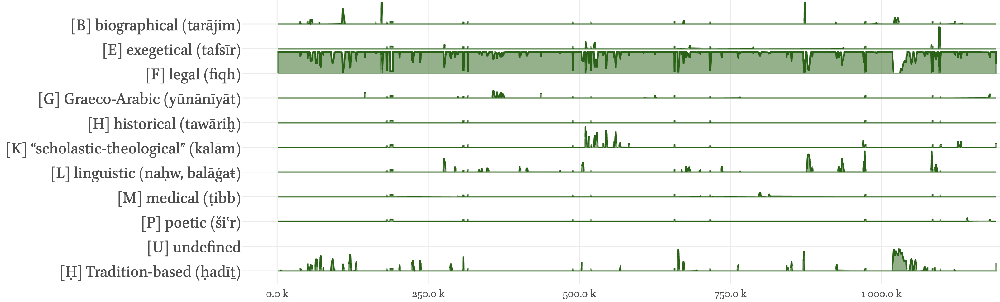

Rolling typological assessment of <i>Kitāb al-Umm</i> of al-Šāfiʿī (d. 204/820) a single dominant type — [F] legal — running almost unbroken from beginning to end.

<!-- G29c -->
--- text

# Rolling Assessment: Ibn al-Jawzī’s <i>Talbīs Iblīs</i>

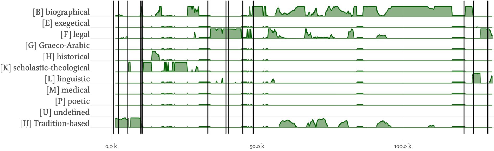

Rolling typological assessment of <i>Talbīs Iblīs</i> of Ibn al-Jawzī (d. 597/1201) shows that individual chapters (separated by vertical black lines) usually contain text reflecting specific types.

<!-- K36 -->
--- text
# Majmūʿāt Case

<strong>Value for manuscripts:</strong>

<ol class="indent">
<li>When HTR starts working, we will need a mechanism to assess HTR-ed texts automatically: we can potentially identify type, author, exact text</li>
<li>Particularly valuable for <em>majmūʿāt</em> — the most numerous kind of manuscripts, the most difficult to read and analyze</li>
</ol>

<!-- S4 -->
--- section light

Case 3

# A Tradition

language change and topic shifts through chronological layers of books

<!-- K39 -->
--- split w-60-40
# Case 3. Periodization

<ul class="plain" style="color:var(--muted)">
<li>Preclassical &nbsp; c. 622–750</li>
<li>Classical &nbsp; 750–1258</li>
<li>Postclassical &nbsp; 1258–1798</li>
<li>Modern &nbsp; 1798–</li>
</ul>

<b>Preclassical</b>600–750

<b>Classical</b>750–1258

<b>Postclassical</b>1258–1798

<b>Modern</b>1798–

Where do these boundaries come from? What if we ask the corpus?

|||

<em>Geschichte der arabischen Litteratur</em>, 5 vols. (1896–1943)

<em>Cambridge History of Arabic Literature</em>, 6 vols. (1983–2006)

<em>Encyclopedia of Arabic Language and Linguistics</em> (Brill)

<!-- K42 -->
--- section light

Two witnesses

# First witness: Corpus

<!-- K43 -->
--- figure

<!-- K44 -->
--- text 
# Two lenses on change

<strong>Keywords</strong> (TF–IDF): <em class="muted">what texts are about</em> 
<strong>Style</strong> (MFV): <em class="muted">how texts are written</em>

<ul>
<li><strong>Hundreds of parameter combinations</strong></li>
<li><strong>3,000 random samples (MFV)</strong></li>
<li><strong>72,000 dendrograms » 48 consensus trees</strong></li>
</ul>

Do not trust a tree. Ask what survives across trees.

<b>Content</b><em>keywords / TF–IDF</em>

<b>Style</b><em>most frequent vocabulary</em>

<!-- K45 -->
--- split w-25-75 vcenter tight
# Style

stylometry

<ul class="small" style="font-style:italic">
<li>distributions of frequencies of most frequent words (function words) are unique to individual:</li>
</ul>
<ul class="small" style="font-style:italic;list-style:disc">
<li><strong class="accent">authors</strong></li>
<li>periods</li>
</ul>

|||

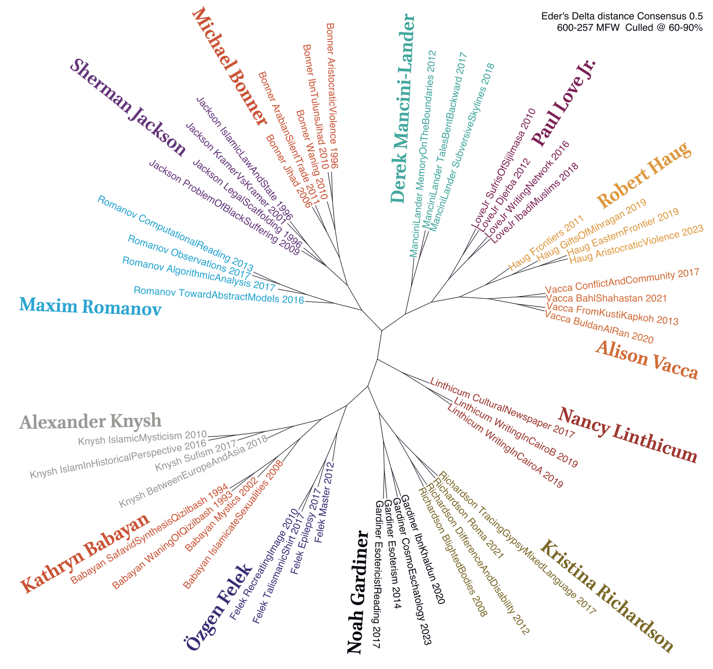

<!-- K46 -->
--- split w-25-75 vcenter tight
# Style

stylometry

<ul class="small" style="font-style:italic">
<li>distributions of frequencies of most frequent words (function words) are unique to individual:</li>
</ul>
<ul class="small" style="font-style:italic;list-style:disc">
<li>authors</li>
<li><strong class="accent">periods</strong></li>
</ul>

<strong>Jurjī Zaydān’s writings</strong> (1) 1891–1902  (2) 1903–1905  (3) 1906–1914

|||

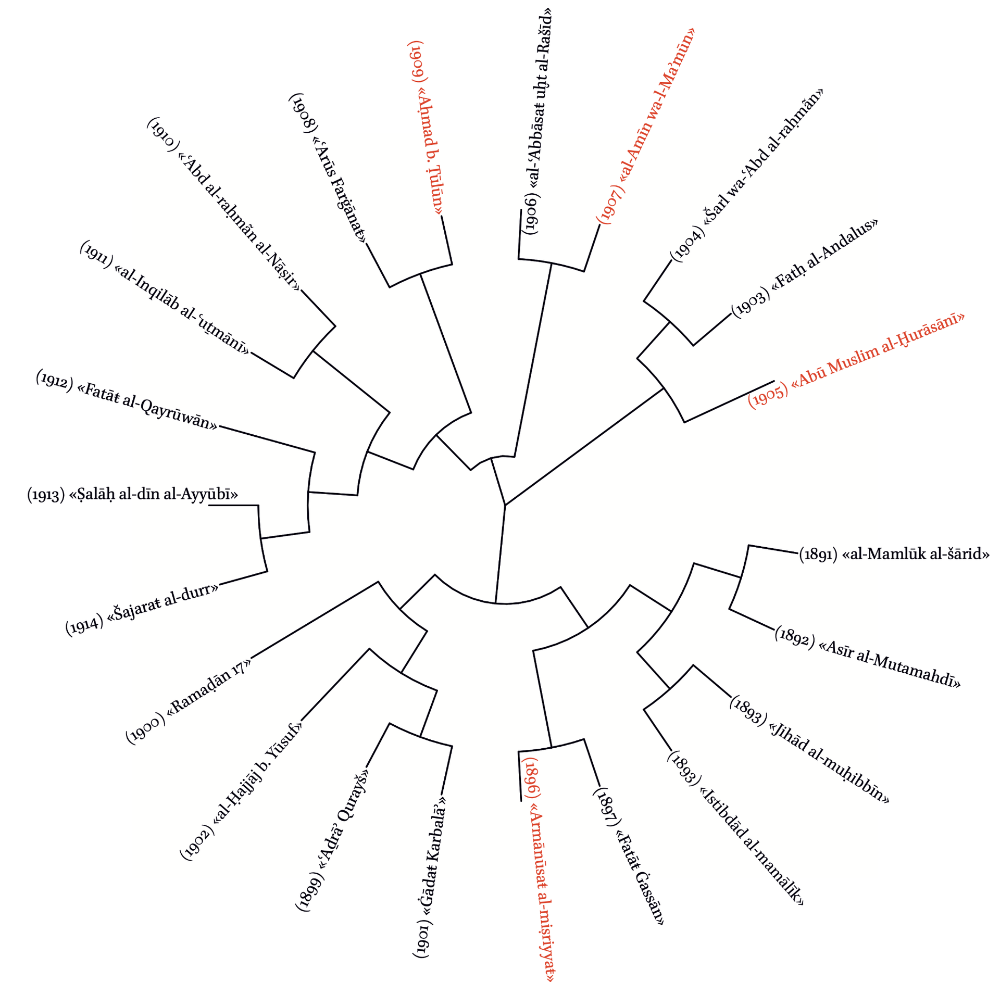

<!-- K47 -->
--- figure caption="A single dendrogram of 50-lunar-year samples of the corpus, colored by macroperiod. Hijrī dates!"
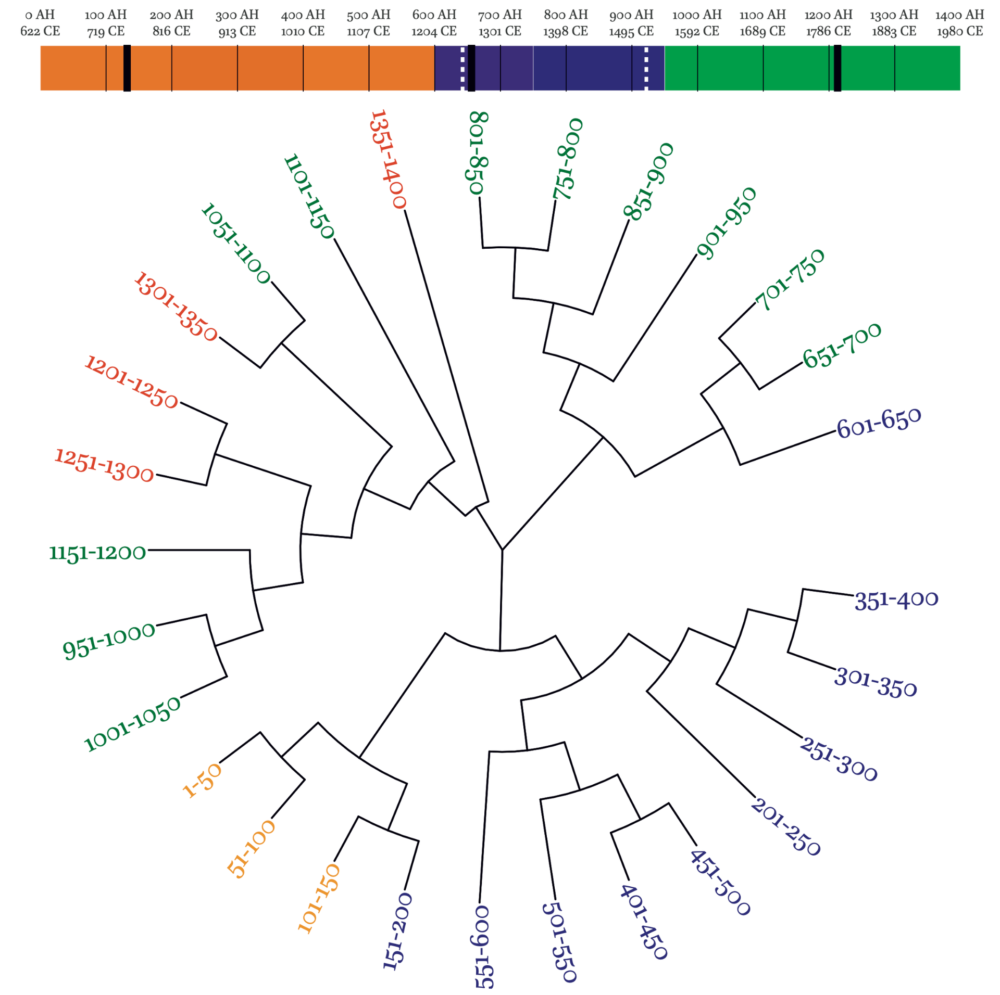

<!-- K48 -->
--- figure caption="72,000 dendrograms: hundreds of parameter combinations over 3,000 random samples."
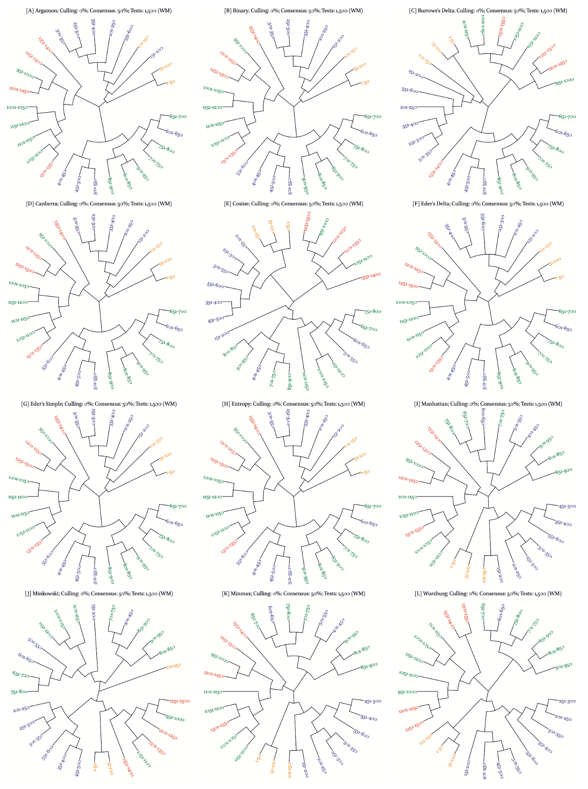
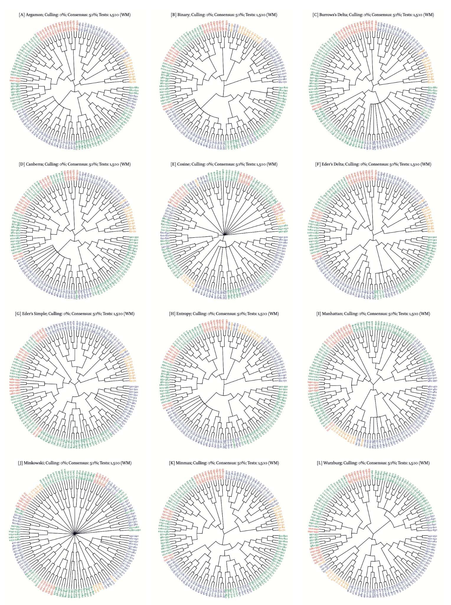

<!-- K49 -->
--- figure caption="Summary stripe diagrams: what survives across the trees."
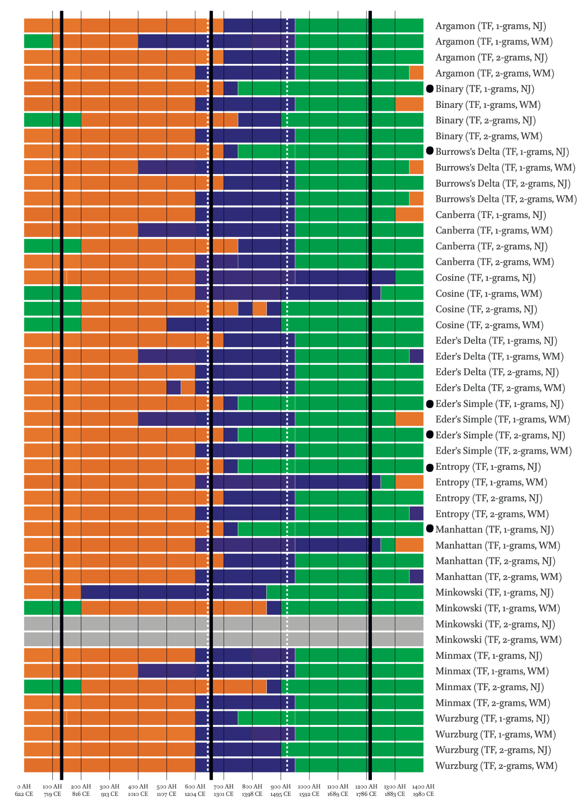
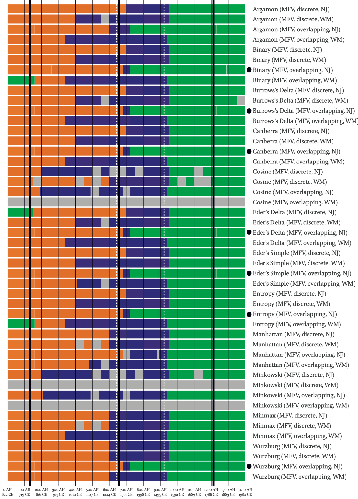

<!-- K50 -->
--- text
# Major periods

<ul class="indent">
<li>The early macroperiod (622–1200)</li>
<li>The middle macroperiod (1200–1540)</li>
<li>The late macroperiod (1540–1980)</li>
</ul>

<strong>Results of majority of 72,000 dendrograms:</strong>

3,000 stylometric samples (1,500 discrete; 1,500 overlapping) 12 distance metrics, 2 major clustering algorithms; 48 tf-idf keyword tests.

<!-- K51 -->
--- text 
# The middle macroperiod (c. 1200–1540)

<ul class="indent">
<li><em>Thematic profiles</em> isolate it as a distinct period</li>
<li><em>Stylometric profiles</em> often attach it to the early macroperiod</li>
<li>The language evolves slower than the written tradition: new distinct themes, but older language</li>
</ul>

Two clocks: themes shift faster than language.

<!-- K52 -->
--- text
# A different macrohistory of the written tradition

<ul class="plain indent">
<li>Early: c. 622–1200</li>
<li>Middle: c. 1200–1540</li>
<li>Late: c. 1540–1980</li>
<li>Boundaries are transition zones, not event dates</li>
</ul>

<b>Early</b>c. 622–1200

<b>Middle</b>c. 1200–1540

<b>Late</b>c. 1540–1980

<!-- K53 -->
--- section light

Two witnesses

# Second witness:  Bio-Bibliographical Collection

<!-- K54 -->
--- text
# Second witness: 8,800 authors

Ismāʿīl Bāšā al-Baġdādī (d. 1338/1919)

<em>Hadiyyat al-ʿārifīn</em> <em>c. 8,800 authors; 40,000+ titles</em> A bio-bibliographical model of the tradition

<strong>Independent of the corpus experiments</strong>

<b>8,800</b>authors

<b>40,000+</b>titles

<!-- K55 -->
--- text
# c. 600–1200: an Iraqi-Iranian world
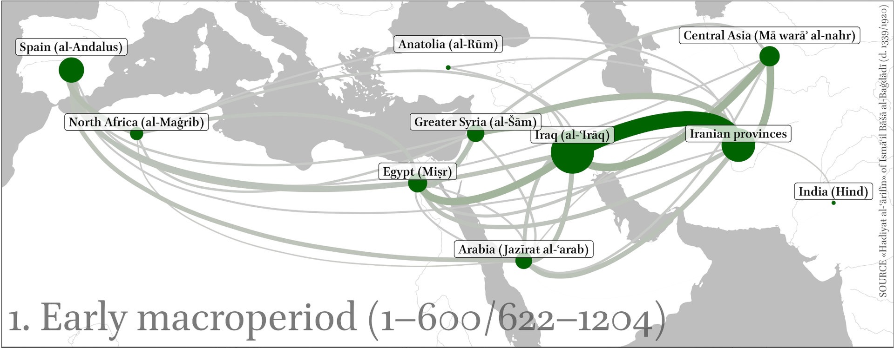

<b style="font-size:36px">&gt; 80% Iraq + Iran</b>

<!-- K57 -->
--- text
# c. 1200–1540: a Syrian-Egyptian world
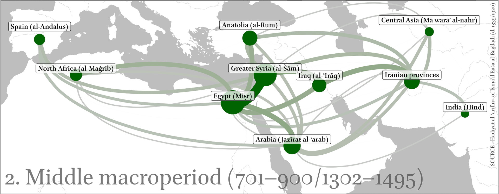

<b style="font-size:36px">&gt; 55% Egypt + Syria</b>

<!-- K59 -->
--- text
# c. 1540–1900: a new polycentric geography
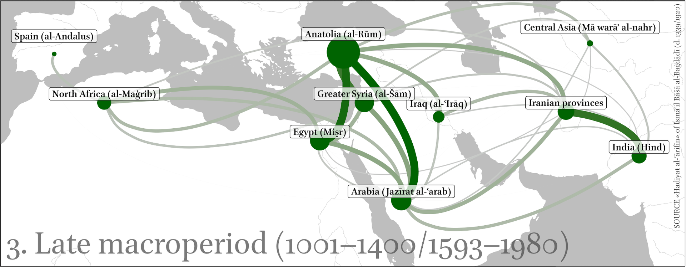

<b style="font-size:36px">≈ 30%  Anatolia</b>

<!-- K63 -->
--- text
# Two transitions: <strong>1200–1300</strong> and 1500–1600
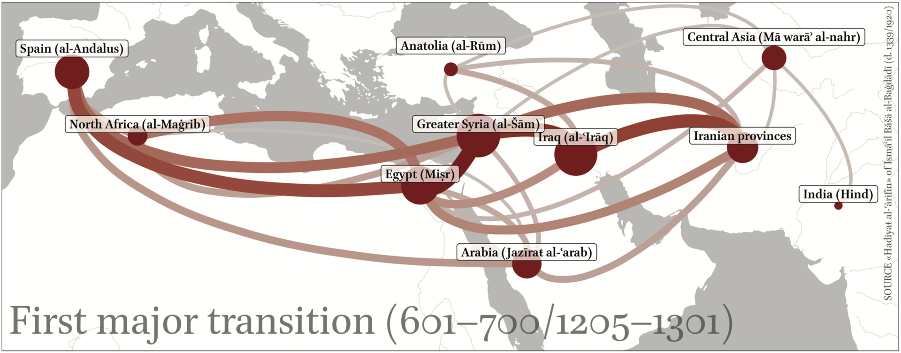

<!-- K65 -->
--- text
# Two transitions: 1200–1300 and <strong>1500–1600</strong>
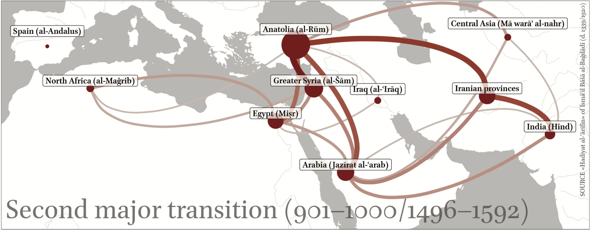

<!-- K66 -->
--- text
# Two independent witnesses

<strong>CORPUS of TEXTS</strong> lexical/thematic and stylometric change

<strong>REGISTER of AUTHORS</strong> cultural geography over time

Different biases. Different assumptions.  Similar macro-boundaries.

<!-- K67 -->
--- text
# Three long cultural regimes (macroperiods)

<ol class="indent">
<li>The early Iraqi-Iranian &nbsp;·&nbsp; <em>c. 622–1200</em></li>
<li>The middle Syrian-Egyptian &nbsp;·&nbsp; <em>c. 1200–1540</em></li>
<li>The late Turco-Indian &nbsp;·&nbsp; <em>c. 1540–1980</em></li>
</ol>

(with discernable sub-periods inside each)

<!-- K69 -->
--- text
# Periods are also places

<ul class="indent">
<li><strong>Traditional periodization</strong> assumes universality</li>
<li><strong>Corpus-driven, computational periodization</strong> demonstrates that <em>language and textual production are aligned in time with changing cultural geography</em></li>
</ul>

Each period gets not just a name, but also a map.

<!-- K70 -->
--- text
# What changes if we accept this model?

<ul class="indent">
<li>The Mamluk centuries become a coherent middle period, <em>not the beginning of decline</em></li>

<li><strong>c. 1540</strong> emerges as a major structural break (essentially, the end of the Mamluk period); not 1258, the fall of Baġdād and of the ʿAbbāsids</li>

<li>Chronology <i>&amp;</i> geography become part of the same explanation</li>
</ul>

--- section light

The instrument, again

# Back to the Corpus

Three case studies later — what can this instrument actually tell us?

<!-- K70b -->
--- text
# But a corpus is also a historical source

<ul class="indent">
<li>Survival bias — what reached us</li>
<li>Editorial / digitization bias — what modern scholars chose to publish</li>
<li>Uneven genre and chronological coverage</li>
<li>Varying representation of different communities</li>
</ul>

Source criticism begins with the instrument.

<!-- K15 -->
--- figure
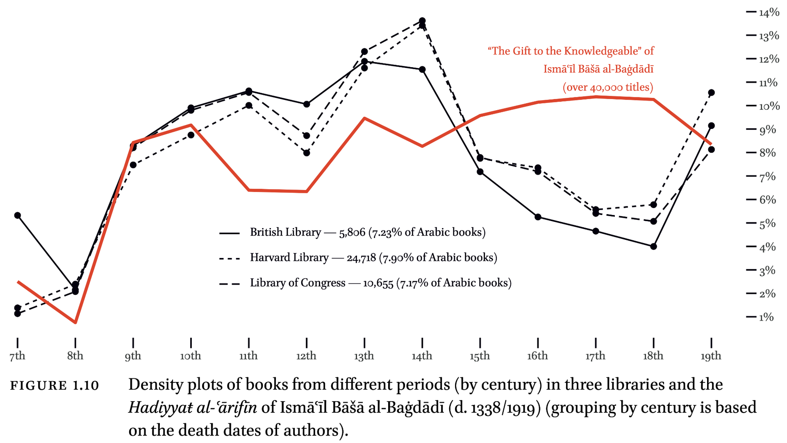

<!-- K16 -->
--- figure
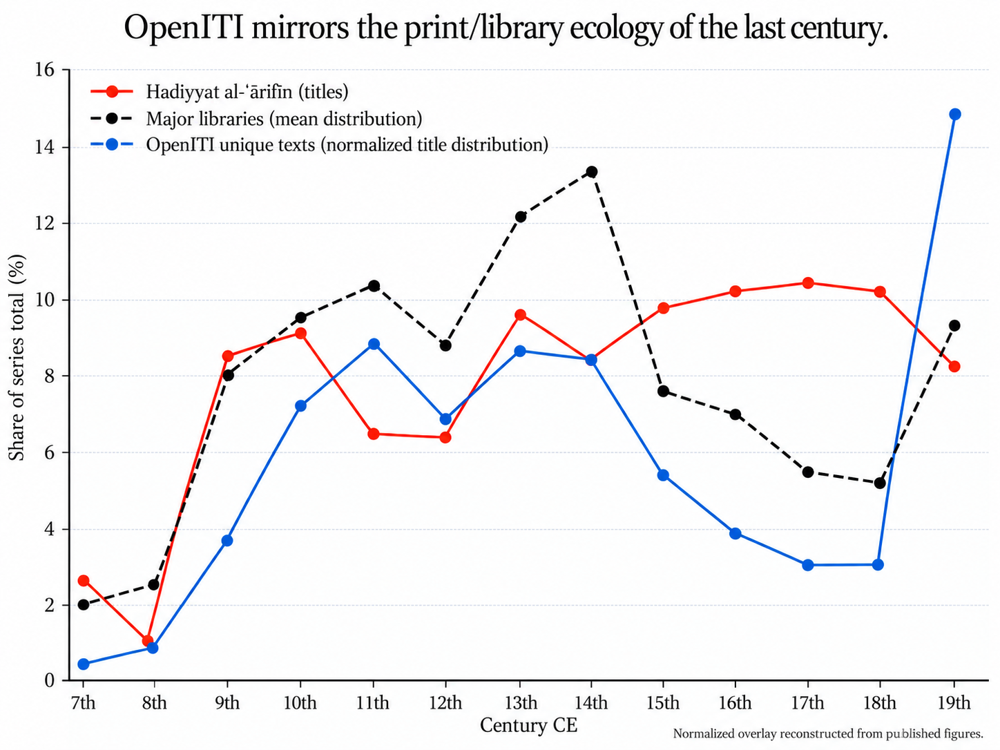

<!-- S2 -->
--- quote
No text can be read alone. Every text needs all the others.

<!-- S2 -->
--- quote
No manuscript can be read alone. Every manuscript needs all the others.

<!-- K73 -->
--- split w-35-65 no-strip
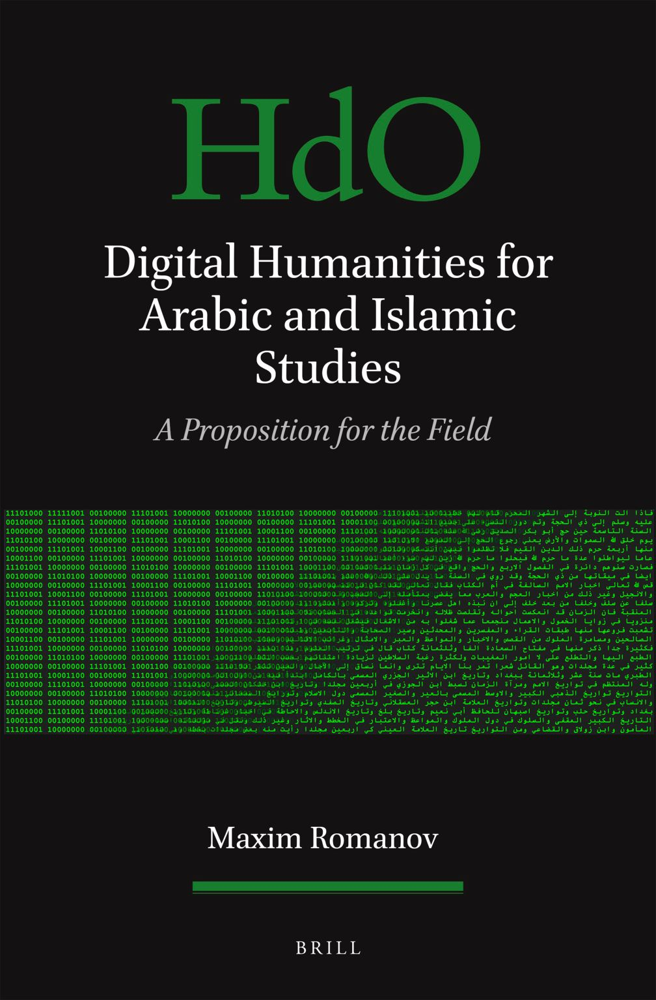

|||

In short, this book asks:

«What does it mean for our field when the entire library becomes a vademecum — something that, quite literally, “goes with me” everywhere?»

<h3 style="font-size:0.70em;font-style:normal;border-top:2px solid var(--red);padding-top:.35em">Chapter 1</h3>
Why we should even bother—a question that remains at the heart of every discussion about the digital.

<h3 style="font-size:0.70em;font-style:normal;border-top:2px solid var(--red);padding-top:.35em">Chapter 2</h3>
How we might go about harnessing the new digital opportunities within the field.

<h3 style="font-size:0.70em;font-style:normal;border-top:2px solid var(--red);padding-top:.35em">Chapter 3</h3>
What we can expect to accomplish: 1) trace term usage 2) model textual typology 3) chart linguistic evolution

Altogether, the book proposes a vision of digital humanities relevant to the field of <strong>Arabic and Islamic studies</strong>. It argues that this venture is not about cheating, but about keeping up with the rest of the world and ensuring that the future of the field remains in our own hands.

