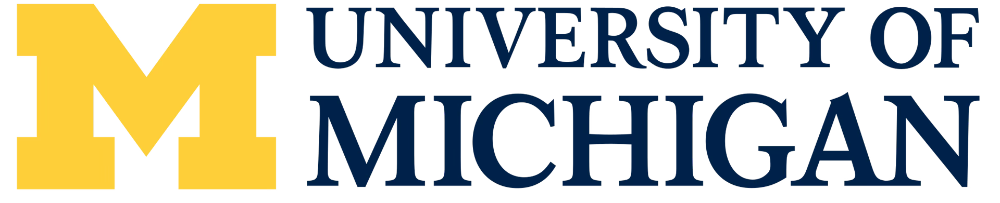
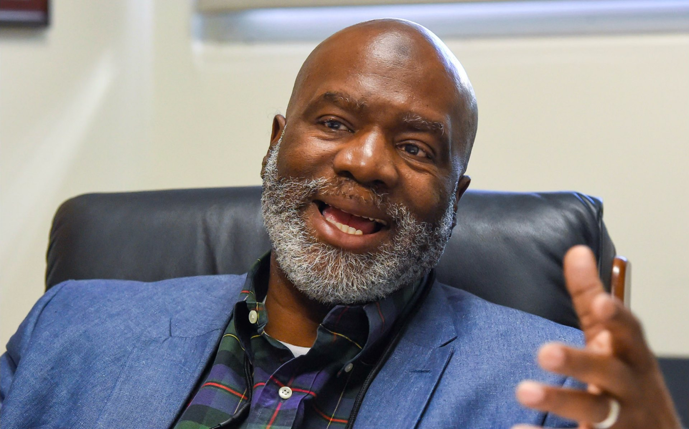
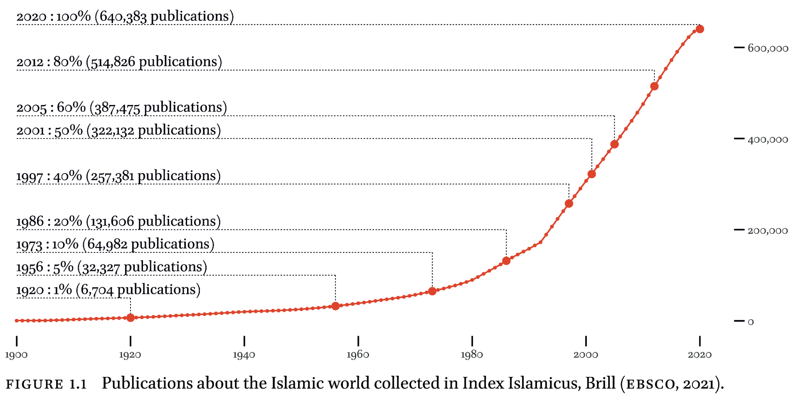
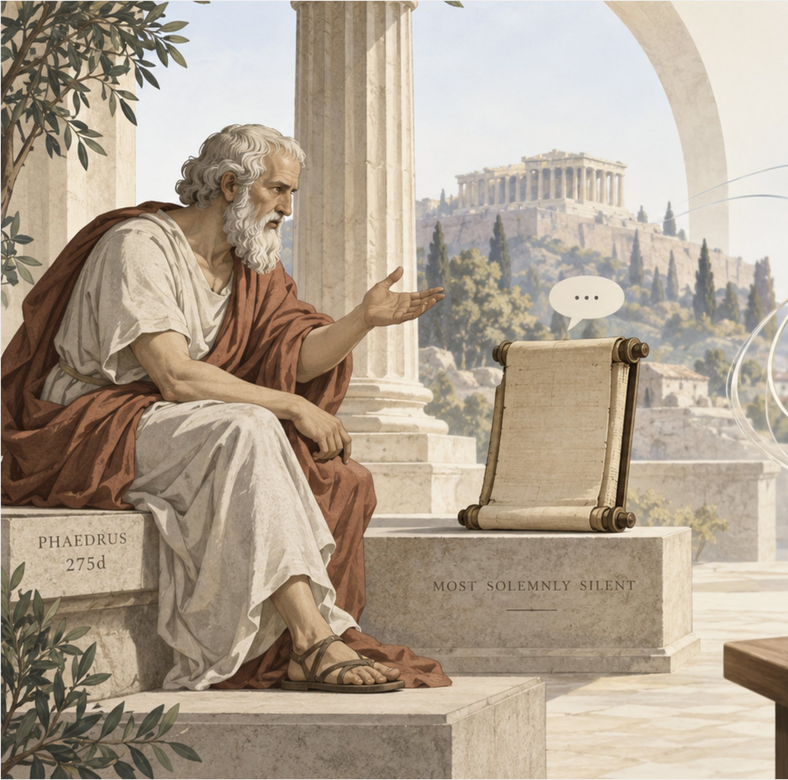
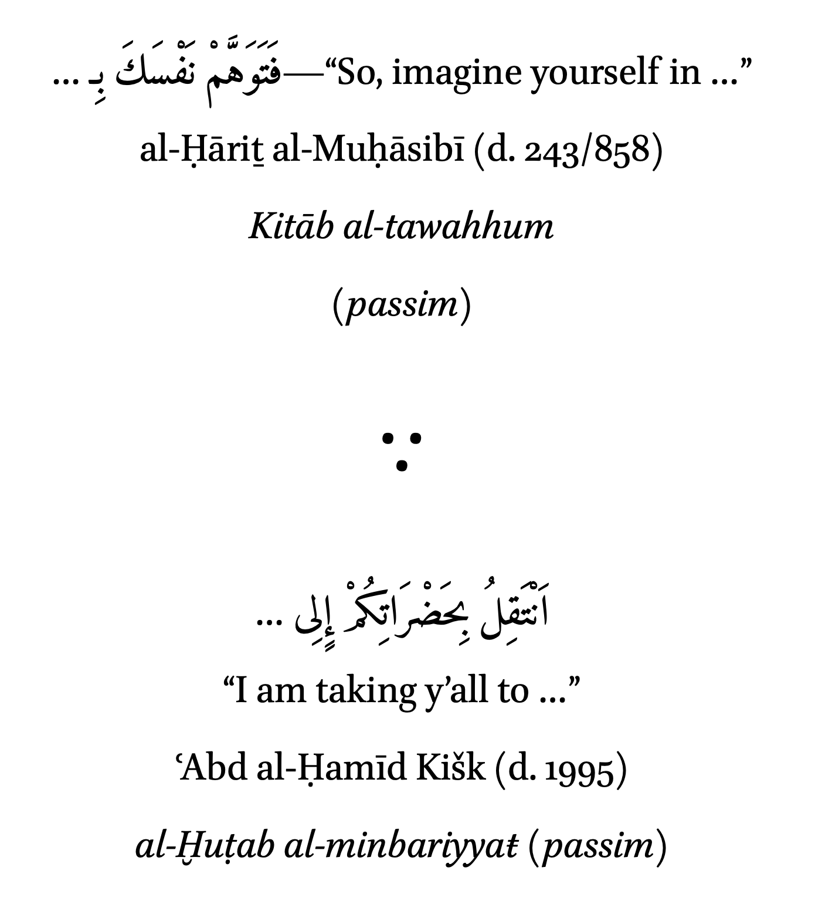

# Slides from the keynote not used in the Cairo deck
# (paste any of them back into deck.md)

<!-- K5 -->
--- full

<!-- K6 -->
--- full

<em>al-Jāmiʿ al-Kabīr? Shamela? C’mon, man, that is cheating!</em>— Prof. Sherman Jackson

<!-- K7 -->
--- text
# Tracing Concepts over time with <em>The Secret Weapon</em>

<h3>Senior Scholar</h3>

Decades of notes. Thousands of hours in the stacks. This kind of work was the prerogative of senior scholars.

<h3>Graduate Student</h3>

One searchable library. Hundreds of classical Arabic texts. A senior scholar visibly unsettled. A tool never acknowledged.

“Why would he? These weren’t ‘real’ books. Only books needed to be cited.”

<!-- K8 -->
--- text
# Not the first revolution, not the last…

Oral/Aural

Written

Print

Digital

Unlike classicists — who have been digitizing Greek and Latin texts since the 1980s — scholars of Arabic and Islamic studies had almost nothing to do with the appearance of our digital corpus.

<blockquote>“A scan through recent academic publications can easily leave the impression that our digital corpus does not exist at all, or if it does, it is of relatively little consequence.” — Travis Zadeh, 2016</blockquote>

<!-- K9 -->
--- figure
# Mountain of information

<!-- K10 -->
--- figure
# Scholarship doubled between 2000 and 2020!

<!-- K17 -->
--- text
# The Proposition: <em>Four Domains</em>

IDigital AvatarsMachine-readable editions of manuscripts and printed books

IIMetaobjectsCorpora, databases, and linked open data at scale

IIIComputational MethodsStatistics, stylometry, and NLP adapted for Arabic

IVNetworksKnowledge networks: text, person, place, and time connected

Each domain depends entirely on the success of the preceding ones — no shortcuts.

<!-- K18 -->
--- text
# Digital Pragmatism: <em>born from necessity, not ideology</em>

It is truly sustainable only if you can do it alone.

<ul class="plain small" style="max-width:32em;margin:0 auto">
<li>— Bare minimum technologies: limit without compromising necessary complexity</li>
<li>— Learn them deeply: no dependency on external technical support</li>
<li>— Automate repetition: your time is better spent elsewhere</li>
</ul>

“Simple, but not simpler.” “Laziness is the engine of the progress.”

<!-- K19 -->
--- text
# Digital Pragmatism: <em>born from necessity, not ideology</em>

It is truly sustainable only if you can do it alone.

<ul class="plain small" style="max-width:32em;margin:0 auto">
<li>— Bare minimum technologies: limit without compromising necessary complexity</li>
<li>— Learn them deeply: no dependency on external technical support</li>
<li>— Automate repetition: your time is better spent elsewhere</li>
</ul>

“Simple, but not simpler.” “Laziness is the engine of the progress.”

<b style="font-size:1.10em;color:var(--red)">+ LLMs</b>

<!-- K20 -->
--- split w-40-60
# The irony of new media

|||

The classical critique of books

“If anyone asks them anything, they remain most solemnly silent.”

— Plato, Phaedrus 275d

Writing was once suspect; today written texts are our scholarly gold standard.

The modern parallel

<strong>Now, knowledge from LLMs is suspect…</strong>

<strong>…yet LLMs bring dialogue back to reading.</strong>

The ultimate irony: technology restores the interactive conversation Plato feared was lost.

Notes:
There is a certain historical irony here. In the Phaedrus, writing itself appears as an inferior technology of knowledge because a written text cannot answer back. More than two millennia later, we have made written scholarship the gold standard of academic knowledge. And now we are instinctively suspicious of another new medium. What interests me pedagogically about LLMs is that they unexpectedly restore one feature Socrates thought writing had lost: dialogue.

<!-- K21 -->
--- full contain

<!-- K22 -->
--- agenda
Case Study 1: Tracing Term Usage
Case Study 2. Modeling Textual Typology
Case Study 3. Charting Linguistic Evolution

<!-- K23 -->
--- agenda
* Case Study 1: Tracing Term Usage
Case Study 2. Modeling Textual Typology
Case Study 3. Charting Linguistic Evolution

<!-- K32 -->
--- agenda
Case Study 1: Tracing Term Usage
* Case Study 2. Modeling Textual Typology
Case Study 3. Charting Linguistic Evolution

<!-- K37 -->
--- agenda
Case Study 1: Tracing Term Usage
Case Study 2. Modeling Textual Typology
* Case Study 3. Charting Linguistic Evolution
